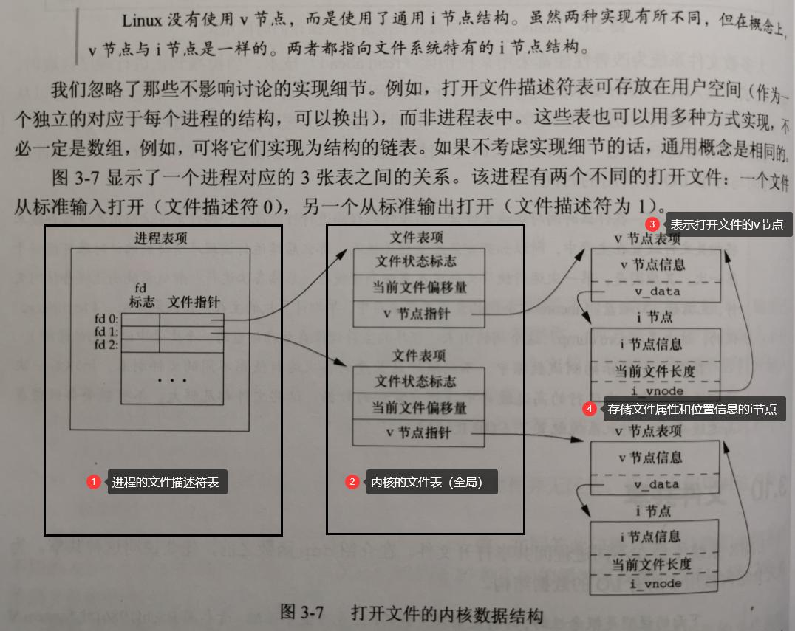
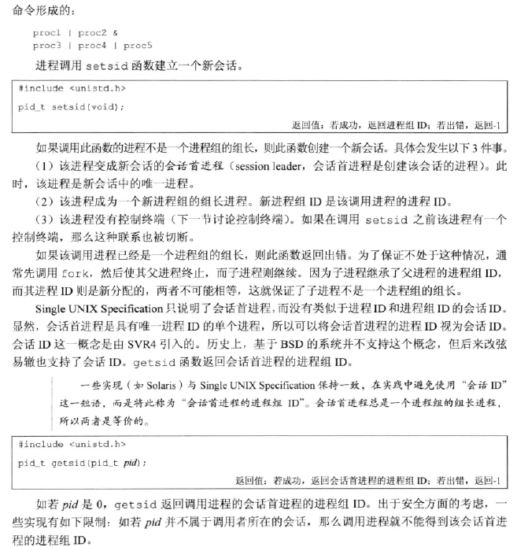
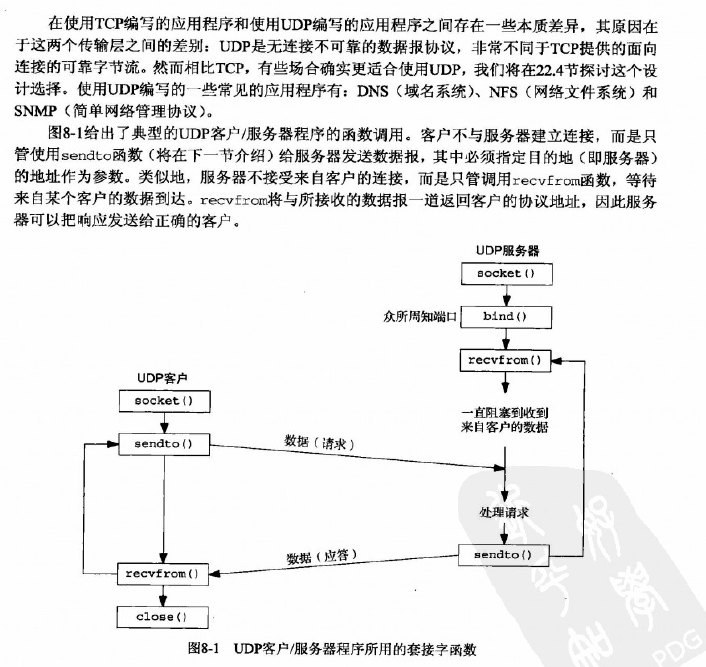

[TOC]

   

  

# 1. 基础知识

## 1.1 Unix体系结构

从严格意义上来说，可将操作系统定义为一种软件，它控制计算机硬件资源，提供程序运行环境。

通常也把这种软件，即操作系统，称为内核（kernel），由于它较小，且位于环境的核心。


内核的接口被称为**系统调用**（system call，图中阴影部分），由于内核是C写的，实际上系统调用也是一系列操作系统提供的C函数


## 1.2 文件和目录

- 文件系统

  Unix文件系统是目录和文件的一种层次结构，所有东西的起点是称为**根（root）**的目录，这个目录的名称是单个字符"/"。

- 文件名

  目录中的各个名字称为文件名（filename）。只有斜线（/）和空格这两个字符不能出现在文件名中，建议限制文件名在字符集:字母（a-z A-Z），数字（0-9），英文句号（.），短横线(-）和下划线（_）

  创建新目录时会自动创建两个文件名：.（称为点）和..（称为点点），点指向当前目录，点点指向父目录。最高层次的根目录中，点点与点相同，都指向当前目录/root

- 路径名

  由斜线分隔的一个或多个文件名组成的序列（也可以斜线开头）构成路径名（pathname），以斜线开头的


## 1.3 输入和输出（IO）

1. 文件描述符

   文件描述符（file descriptor）通常是一个小的非负整数，内核用来标识一个特定进程正在访问的文件。

   打开或创建一个新文件，返回的是一个文件描述符，后续读写操作都是针对这个文件描述符的

2. 标准输入、标准输出和标准错误

   每运行一个新程序时，Unix都会为该程序的进程打开3个文件描述符，即标准输入（standard input），标准输出（standard output）和标准错误（standard error）。 注：标准错误，实际上也是输出，更准确的可以叫做标准错误输出。

   

## 1.4 程序和进程

1. 程序（program）是一个存储在磁盘上某个目录中的可执行文件。内核使用exec函数（7个exec函数之一），将程序读入内存，并执行程序。

2. 进程和进程ID

   程序的执行实例被称为进程（process）。 process = program + data + pcb。 进程 = 程序 + 数据 + 进程控制块（记录进程状态信息，例如运行到第几行）

   Unix系统确保每个进程都有一个唯一的数字标识符，称为进程ID（process ID），这个ID是非负整数

3. 进程控制

   有三个进程控制函数：fork，exec和waitpid（其中exec包含7种）

4. 线程和线程ID

   一个进程内的所有线程共享同一地址空间、文件描述符、栈以及与进程相关的属性。因为它们可以访问同一存储区，所以需要各线程在访问共享数据时需要采取同步措施。

   线程ID只在它所属的进程内起作用。一个进程中的线程ID在另一个进程中没有意义。当在一进程中对某个特定线程进行处理时，我们可以使用该线程的ID引用它。

   

## 1.5 登录和用户标识

**登录**

用户在登录Unix系统时，先输入登录名，然后输入口令。系统在其口令文件（通常为/etc/passwd文件）中查看登录名。

口令文件中的登录项由7个以冒号为间隔的字符串组成，依次是：

例如：

```shell
hugo:x:205:105:guoyiming:/home/hugo:/bin/bash
```


| 登录名 | 加密口令 | 数字用户ID | 数字组ID | 注释字段  | 起始目录   | shell程序 |
| ------ | -------- | ---------- | -------- | --------- | ---------- | --------- |
| hugo   | x        | 205        | 105      | guoyiming | /home/hugo | /bin/bash |


**用户标识**

1. 用户ID

   口令文件登录项中的用户ID（user ID） 是一个数值，它向系统标识各个不同的用户。其中用户ID为0的用户是根用户（root）或者超级用户（super user），具有超级权限。

2. 组ID

   口令文件登录项也包括用户的组ID（group ID），它是一个数值。组用于将若干用户集合到项目或部门中去，这种机制允许同组的各个成员之间共享资源（权限）。

   组文件将组名映射为数值的组ID。组文件通常是/etc/group

3. 附属组ID

   除了在口令文件中对一个登录名指定一个组ID外，大多数Unix系统还允许一个用户属于另外一些组，允许一个用户属于至多16个组。登录时，读文件/etc/group，寻找列有该用户作为其成员的前16个记录项就可以得到该用户的附属组ID（supplementary group Id）。

## 1.6 信号

信号（signal）用于通知进程发生了某种情况。

进程有以下3种处理信号的方式：

1. 忽略信号
2. 按系统默认方式处理。
3. 提供一个函数，信号发生时调用该函数，这称为捕捉该信号。


## 1.7 系统调用和库函数

所有的操作系统都提供多种服务的入口点，由此程序向内核请求服务，这些入口点被称为系统调用（system call）。

从应用角度考虑可将系统调用视为C函数。

系统调用的C函数只提供了需要跟操作系统交互的最简接口，而通常应用程序不会直接调用**系统调用的C函数**，而是去调用**库函数**，库函数封装了绝大多数日常需要的算法和功能，部分库函数中用到的了1个或多个系统调用。

例如：

Unix系统调用中处理存储空间分配的是sbrk，它可以按指定字节数增加或减少进程地址空间。

C中malloc按照某种存储算法实现特定类型的存储空间分配，其中若需要增加或减少进程地址空间，就需要调用sbrk。

内核中的系统调用分配一块空间给进程，而库函数malloc在用户层面去管理这一空间。


**注：实际上只要与操作系统交互（读写硬件），必定需要执行对应的系统调用，无非代码里自己手动直接执行，还是用了库函数间接执行。**


# 2. 文件IO

可用的文件IO函数有打开文件、读文件、写文件等。

Unix系统中文件IO会用到以下系统调用函数：（也意味着这里的IO是无缓冲的，unbuffered I/O）

- open/openat

  打开或创建一个文件

  

- create 

  创建一个新文件 （等价于open函数传入了限制必须原文件不存在的参数）

  

- close 

  关闭一个打开的文件

  

- lseek

  每个打开文件都有一个与其相关联的“当前文件偏移量”（current file offset）。它通常是一个非负数，用于标示从文件开始处计算的字节数。

  lseek可以显式的为一个打开文件设置偏移量

  

- read 从打开的文件读取n字节数据

  

- write 向打开的文件写入n字节数据


## 2.1 文件描述符

对于内核而言，所有打开的文件都通过文件描述符引用，文件描述符是一个非负整数。文件均由某个进程打开，所以文件描述符是属于某个进程的，但也可以通过某种方式实现多个进程共享文件描述符。

**特殊的文件描述符**：

- 0 标准输入
- 1 标准输出
- 2 标准错误（输出）


## 2.2 文件共享

Unix系统支持在不同进程间共享打开文件。

### 2.2.1 内核用于所有I/O的数据结构

内核使用3种数据结构表示打开的文件：

**（1）每个进程在进程表中都有一个记录项，记录项中包含一张文件描述符表。图3-7**

表中每一项包含2部分：

​		a. 文件描述符标志

​		b. 指向文件表项的指针

**（2）内核为所有打开文件维持一张文件表。每个文件表项（记录文件状态）包含：**

​		a. 文件状态标志（读、写、添加、同步和非阻塞等）

​		b. 当前文件偏移量

​		c. 指向该文件v节点表项的指针

**（3）每个打开文件（或设备）都有一个v节点（v-node）结构。**

v节点包含了

​		a. 文件类型

​		b. 对此文件进行各种操作的函数的指针

​		c. 该文件的i节点（i-node，索引节点，包含文件的所有者、文件长度、指向文件实际数据快在磁盘上所在位置的指针），若文件类型是普通文件有该项。

由于Unix系统把所有东西都按照文件去处理，例如打开一个socket连接，实际上会创建一个表示该socket连接的文件，对这个表示连接的文件进行输入输出，实际上就对socket进行了输入输出，但此时v节点应该是没有c项的（即没有对应的i节点）？还是有个表示空的i节点




### 2.2.2 在文件共享时内核I/O的数据结构


进程1的文件描述符3打开该文件，进程2的文件描述符4打开该文件。每个打开该文件的进程都会获得各自的一个文件表项，每个进程都可以有它自己对该文件的当前偏移量。但同一个文件只有一个v节点表项。

考虑文件IO系统调用与上述数据结构的关系：

- 每次write后，文件表项中当前文件偏移量即增加写入的字节数，如果偏移量超过了当前文件长度，则需要i节点扩展当前文件长度为此时的偏移量。
- 如果用O_APPEND标志打开一个文件，则这个标志会设置到文件表项的文件状态标志中。
- lseek函数可以修改文件表项中的当前文件偏移，但不进行任何IO


另外，也会出现多个文件描述符指向同一文件表项。（dup函数，fork后父子进程各自的每一个文件描述符共享同一个文件表项）。


**一些系统调用函数**

- 函数dup和dup2 复制一个现有的文件描述符

  

- 函数sync，fsync和fdatasync

  sync只是将修改过的块缓存区排入写队列，然后就返回，它并不等待实际写磁盘操作结束

  fsync等待写磁盘操作结束才返回，可写数据、更新文件属性

  fdatasync类似fsync，但只写文件数据不更新文件属性

  

- 函数fcntl  改变已经打开文件的属性，例如设置文件状态标志（O_APPEND, O_RDONLY之类）

  

  

# 3. 文件系统


## 3.1 文件类型

文件类型包括以下几种：

（1）**普通文件（regular file）**。这是最常用的文件类型，这种文件包含了某种形式的数据。

（2）**目录文件（directory file）**。这种文件包含了其他文件的名字以及指向这些文件有关信息的指针。

（3）**块特殊文件（block special file）**。这种类型的文件提供对设备（如磁盘）带缓冲的访问，每次访问以固定长度为单位进行。

（4）**字符特殊文件（character special file）**。这种类型的文件提供对设备不带缓冲的访问。每次访问长度可变。系统中的所有设备要么是**字符特殊文件**，要么是**块特殊文件**。

（5）**命名管道（named pipe）**。用于进程间的通信（本机的进程之间）。

（6）**套接字（socket）**。这种类型的文件用于进程间的网络通信（跨主机的进程之间）。

（7）**符号链接（symbolic link）**。这种类型的文件指向另一个文件，分为软链接和硬链接。


## 3.2 文件设置用户ID和组ID

当执行一程序文件后，则启动了一个进程。

启动进程的用户（也就是当前登录Unix的用户）决定了**实际用户ID**和**实际组ID**。

**有效用户ID**和**有效组ID**以及附属组ID决定了我们的文件访问权限。

通常，**有效用户ID = 实际用户ID ， 有效组ID = 实际组ID**


但有时，root用户创建的文件需要允许全部用户读写，但是不能给其他用户root权限。

这时就可以对这个文件设置用户ID和组ID，当其他用户启动的进程访问该文件时，会相当于获取了root权限（当然，只是对这个文件来说，也就是只能读写文件）

Linux系统命令可以设置：

```
chmod u+s filename
```


## 3.3 文件访问权限


进程每次打开、创建或删除一个文件时，内核就进行文件访问权限测试。

测试逻辑如下：

（1）若进程的有效用户ID是0，则允许访问。

（2）若进程的有效用户ID等于文件的所有者ID，若该文件设置了用户读，则可以进程可以读文件；若该文件设置了用户写，那么进程可以写文件；若该文件设置了用户执行，那么进程可以执行文件。否则，拒绝访问。

（3）若进程有效组ID或进程的附属组ID之一等于文件的组ID，若对应组权限设置了，可以访问，否则拒绝。

（4）若其他用户访问的权限设置了，可以访问，否则拒绝。


## 3.4 文件系统


磁盘可以划分为多个分区，**每个分区都是一个单独的文件系统**。i节点是固定长度的记录项（索引节点），它包含文件的大部分信息。


1. 超级块
   它是文件系统的第一个块。这个块存放文件系统结构信息，如每个区的大小，还记录这个磁盘块未使用空间信息。

2. i-node节点表
    每个文件的属性信息存放在这个表中，以i-node号为索引，所有i-node大小相同，是一个i-node数组，每个文件在都对应着唯一一个i-node号，即一个唯一的i-node节点。但是某个i-node节点可能对应多个文件名/目录名，这个后面提到。

3. 数据区
    数据区存放文件实际内容。磁盘是按固定大小分块的，如果一个文件的大小超过了一个块的内容，那就为它分配多个块来存储。

   

   

**普通文件的链接计数：**


- 硬链接。每有一个目录项硬链接指向i节点，i节点的链接计数就+1，删除这个目录项，则i节点链接计数-1。只有当链接计数为0时，这个文件所占用的文件块才可以释放。

- 软链接（符号链接）。软链接拥有自己的i节点和block，但是数据块中只保存源文件的文件名和i节点，并没有实际的文件数据。

  例如：下面例子，目录项中的文件名是lib，此时会有这个文件名对应的一个新的i-node，这个i-node指向的数据块中存了7个字节的数据usr/lib

  ```shell
  lrwxrwxrwx 1 root 7 Sep 25 07:14 lib - > usr/lib
  ```

- i节点包含了文件有关的所有信息：文件类型、文件访问权限位、文件长度和指向文件数据块的指针等。

注：此处目录项指文件名。

**硬链接就是目录项直接指向这个i节点，软链接是新创建一个i节点和其对应的数据块，在数据块中存源文件名/目录名**。


**目录文件链接计数：**


有以下目录关系：

```
/home   -> i节点1267
/home/. -> i节点1267
/home/.. -> 某个i节点编号（/home的父文件夹的i节点编号）

/home/testdir    -> i节点2549
/home/testdir/.  -> i节点2549
/home/testdir/.. -> i节点1267

所以一个/director本身，链接计数就是2，,命名它的/director和在该目录中的. 即/director/.
注：此处目录项指目录名。
若有目录有一个子目录，子目录中会有一个..指向父目录，所以此时父目录链接计数为3，有3个目录项指向父目录的i节点，示例中的/home就是如此

图中意思是：
[2569, /home/testdir/.]
[1267,/home/testdir/..]

[1267, /home/.]
[i节点编号， /home/.. ]
[2549，/home/testdir]

```


# 4 I/O复用：select、poll和epoll


## 4.1 I/O模型

Unix下有5种I/O模型：

- 阻塞式I/O
- 非阻塞式I/O
- I/O复用（select、poll和epoll）
- 信号驱动式I/O（SIGIO）
- 异步I/O（POSIX的aio_系列函数）

### 4.1.1 阻塞式I/O模型


### 4.1.2 非阻塞式I/O模型


### 4.1.3 I/O复用模型


### 4.1.4 信号驱动式I/O模型


### 4.1.5 异步I/O模型


### 4.1.6 各种I/O模型的比较

**同步I/O和异步I/O**


应注意I/O是分两步：

- 先去查看是否有数据（可能阻塞）
- 若有读数据（可能阻塞）

只有这两步都不阻塞，才是异步I/O，否则就是同步I/O


## 4.2 I/O多路复用

select，poll，epoll都是IO多路复用的机制。I/O多路复用就是通过一种机制，一个进程可以监视多个描述符，一旦某个描述符就绪（一般是读就绪或者写就绪），能够通知程序进行相应的读写操作。但select，poll，epoll本质上都是同步I/O，因为他们都需要在读写事件就绪后自己负责进行读写，也就是说这个读写过程是阻塞的，而异步I/O则无需自己负责进行读写，异步I/O的实现会负责把数据从内核拷贝到用户空间。

[参考：Linux IO模式及 select、poll、epoll详解](https://segmentfault.com/a/1190000003063859)

### 4.2.1 select

```c
int select (int n, fd_set *readfds, fd_set *writefds, fd_set *exceptfds, struct timeval *timeout);
```

select 函数监视的文件描述符分3类，分别是writefds、readfds、和exceptfds。调用后select函数会阻塞，直到有描述符就绪（有数据 可读、可写、或者有except），或者超时（timeout指定等待时间，如果立即返回设为null即可），函数返回。当select函数返回后，可以 通过遍历fdset，来找到就绪的描述符。
select目前几乎在所有的平台上支持，其良好跨平台支持也是它的一个优点。select的一 个缺点在于单个进程能够监视的文件描述符的数量存在最大限制，在Linux上一般为1024，可以通过修改宏定义甚至重新编译内核的方式提升这一限制，但 是这样也会造成效率的降低。

### 4.2.2 poll

```c
int poll(struct pollfd *fds, unsignedint nfds, int timeout);
```


不同与select使用三个位图来表示三个fdset的方式，poll使用一个 pollfd的指针实现。

```c
struct pollfd {    
	int fd; /* file descriptor */
    short events; /* requested events to watch */
    short revents; /* returned events witnessed */
};
```

pollfd结构包含了要监视的event和发生的event，不再使用select“参数-值”传递的方式。同时，pollfd并没有最大数量限制（但是数量过大后性能也是会下降）。 和select函数一样，poll返回后，需要轮询pollfd来获取就绪的描述符。

> 从上面看，select和poll都需要在返回后，通过遍历文件描述符来获取已经就绪的socket。事实上，同时连接的大量客户端在一时刻可能只有很少的处于就绪状态，因此随着监视的描述符数量的增长，其效率也会线性下降。

### 4.2.3 epoll

epoll是在2.6内核中提出的，是之前的select和poll的增强版本。相对于select和poll来说，epoll更加灵活，没有描述符限制。epoll使用一个文件描述符管理多个描述符，将用户关系的文件描述符的事件存放到内核的一个事件表中，这样在用户空间和内核空间的copy只需一次。

**(1) epoll操作过程**
epoll操作过程需要三个接口，分别如下：

```c
int epoll_create(int size) 
/*
    创建一个epoll的句柄，size用来告诉内核这个监听的数目一共有多大，这个参数不同于select()中的第一个参数，给出最大监听的fd+1的值，参数size并不是限制了epoll所能监听的描述符最大个数，只是对内核初始分配内部数据结构的一个建议。
    当创建好epoll句柄后，它就会占用一个fd值，在linux下如果查看/proc/进程id/fd/，是能够看到这个fd的，所以在使用完epoll后，必须调用close()关闭，否则可能导致fd被耗尽。
*/    

        
int epoll_ctl(int epfd, int op, int fd, struct epoll_event *event)
/*
函数是对指定描述符fd执行op操作。
op操作：用三个宏来表示：添加EPOLL_CTL_ADD，删除EPOLL_CTL_DEL，修改EPOLL_CTL_MOD。分别添加、删除和修改对fd的监听事件。
epfd：是epoll_create()的返回值。
epoll_event：是告诉内核需要监听什么事，struct epoll_event结构如下：
*/ 
struct epoll_event {  
	__uint32_t events;  /* Epoll events */
    epoll_data_t data;  /* User data variable */
};
/*
events可以是以下几个宏的集合：
EPOLLIN ：表示对应的文件描述符可以读（包括对端SOCKET正常关闭）；
EPOLLOUT：表示对应的文件描述符可以写；
EPOLLPRI：表示对应的文件描述符有紧急的数据可读（这里应该表示有带外数据到来）；
EPOLLERR：表示对应的文件描述符发生错误；
EPOLLHUP：表示对应的文件描述符被挂断；
EPOLLET： 将EPOLL设为边缘触发(Edge Triggered)模式，这是相对于水平触发(Level Triggered)来说的。EPOLLONESHOT：只监听一次事件，当监听完这次事件之后，如果还需要继续监听这个socket的话，需要再次把这个socket加入到EPOLL队列里
*/


int poll_wait(int epfd, struct epoll_event * events, int maxevents, int timeout)
/*
等待epfd上的io事件，最多返回maxevents个事件。
参数events用来从内核得到事件的集合，maxevents告之内核这个events有多大，这个maxevents的值不能大于创建epoll_create()时的size，参数timeout是超时时间（毫秒，0会立即返回，-1将不确定，也有说法说是永久阻塞）。该函数返回需要处理的事件数目，如返回0表示已超时。
*/    
```

**(2) epoll总结**

在 select/poll中，进程只有在调用一定的方法后，内核才对所有监视的文件描述符进行扫描，而**epoll事先通过epoll_ctl()来注册一 个文件描述符，一旦基于某个文件描述符就绪时，内核会采用类似callback的回调机制，迅速激活这个文件描述符，当进程调用epoll_wait() 时便得到通知**。(`此处去掉了遍历文件描述符，而是通过监听回调的的机制`。这正是epoll的魅力所在。)

**epoll的优点主要是一下几个方面：**

1. 监视的描述符数量不受限制，它所支持的FD上限是最大可以打开文件的数目，这个数字一般远大于2048,举个例子,在1GB内存的机器上大约是10万左 右，具体数目可以cat /proc/sys/fs/file-max察看,一般来说这个数目和系统内存关系很大。select的最大缺点就是进程打开的fd是有数量限制的。这对于连接数量比较大的服务器来说根本不能满足。虽然也可以选择多进程的解决方案( Apache就是这样实现的)，不过虽然linux上面创建进程的代价比较小，但仍旧是不可忽视的，加上进程间数据同步远比不上线程间同步的高效，所以也不是一种完美的方案。

2. IO的效率不会随着监视fd的数量的增长而下降。epoll不同于select和poll轮询的方式，而是通过每个fd定义的回调函数来实现的。只有就绪的fd才会执行回调函数。

> 如果没有大量的idle -connection或者dead-connection，epoll的效率并不会比select/poll高很多，但是当遇到大量的idle- connection，就会发现epoll的效率大大高于select/poll。


# 5 零拷贝I/O

## 5.1 硬件I/O（补充计算机组成原理）

补充硬件I/O方式

### 5.1.1 I/O接口类型


### 5.1.2 程序查询方式

程序查询方式的核心问题在于每时每刻需不断查询I/O设备是否能准备就绪。


### 5.1.3 程序中断方式

**中断的概念**


**I/O中断的产生**


### 5.1.4 DMA方式


即一个硬件外设可以通过DMA直接把自己的数据写入内存中的某个区域，不需要等着CPU来读取再写入内存。


## 5.2 什么是零拷贝

[参考：浅谈 Linux下的零拷贝机制](https://www.jianshu.com/p/e76e3580e356)

零拷贝是指CPU不执行从内存的一块区域到另一块区域的无意义数据拷贝。

一个最基本的静态Web服务器返回硬盘上的文件为例：

**传统I/O逻辑**


① 发出read系统调用：导致用户空间到内核空间的上下文切换(第一次上下文切换)。通过DMA引擎将文件中的数据从磁盘上读取到内核空间缓冲区(第一次拷贝: hard drive ——> kernel buffer)。

② 将内核空间缓冲区的数据拷贝到用户空间缓冲区(第二次拷贝: kernel buffer ——> user buffer)，然后read系统调用返回。而系统调用的返回又会导致一次内核空间到用户空间的上下文切换(第二次上下文切换)。

 ③ 发出write系统调用：导致用户空间到内核空间的上下文切换(第三次上下文切换)。将用户空间缓冲区中的数据拷贝到内核空间中与socket相关联的缓冲区中(即，第②步中从内核空间缓冲区拷贝而来的数据原封不动的再次拷贝到内核空间的socket缓冲区中。)(第三次拷贝: user buffer ——> socket buffer)。

 ④ write系统调用返回，导致内核空间到用户空间的再次上下文切换(第四次上下文切换)。通过DMA引擎将内核缓冲区中的数据传递到协议引擎(第四次拷贝: socket buffer ——> protocol engine)，这次拷贝是一个独立且异步的过程。

**总结上述过程，传统的I/O操作进行了4次用户空间内核空间的上下文切换（或者说是用户空间与内核空间的2次来回切换），2次DMA拷贝和2次CPU拷贝。2次DMA拷贝已经是硬件I/O的最优方式，而其中2次CPU拷贝kernel buffer -> user buffer、user buffer-> socket buffer实际上没有意义。（都是在内存中，只是相应内存归属不同，用户空间的，还是内核空间的）**

若能省略无意义的CPU拷贝，便是零拷贝。


## 5.3 sendfile


① 发出sendfile系统调用，导致用户空间到内核空间的上下文切换(第一次上下文切换)。通过DMA引擎将磁盘文件中的内容拷贝到内核空间缓冲区中(第一次拷贝: hard drive ——> kernel buffer)。然后再将数据从内核空间缓冲区拷贝到内核中与socket相关的缓冲区中(第二次拷贝: kernel buffer ——> socket buffer)。

 ② sendfile系统调用返回，导致内核空间到用户空间的上下文切换(第二次上下文切换)。通过DMA引擎将内核空间socket缓冲区中的数据传递到协议引擎(第三次拷贝: socket buffer ——> protocol engine)

**总结上述流程，通过sendfile实现的零拷贝I/O只使用了2次用户空间与内核空间的上下文切换，以及3次数据的拷贝。其中3次数据拷贝中包括了2次DMA拷贝和1次CPU拷贝。**

Q：但通过是这里还是存在着一次CPU拷贝操作，即，kernel buffer ——> socket buffer。是否有办法将该拷贝操作也取消掉了？
 A：有的。但这需要底层操作系统的支持。从Linux 2.4版本开始，操作系统底层提供了scatter/gather这种DMA的方式来从内核空间缓冲区中将数据直接读取到协议引擎中，而无需将内核空间缓冲区中的数据再拷贝一份到内核空间socket相关联的缓冲区中。


**带有DMA收集拷贝功能的sendfile实现的I/O**

从Linux 2.4版本开始，操作系统底层提供了带有scatter/gather的DMA来从内核空间缓冲区中将数据读取到协议引擎中。这样一来待传输的数据可以分散在存储的不同位置上，而不需要在连续存储中存放。那么从文件中读出的数据就根本不需要被拷贝到socket缓冲区中去，只是需要将缓冲区描述符添加到socket缓冲区中去，DMA收集操作会根据缓冲区描述符中的信息将内核空间中的数据直接拷贝到协议引擎中。


① 发出sendfile系统调用，导致用户空间到内核空间的上下文切换(第一次上下文切换)。通过DMA引擎将磁盘文件中的内容拷贝到内核空间缓冲区中(第一次拷贝: hard drive ——> kernel buffer)。
 ② 没有数据拷贝到socket缓冲区。取而代之的是只有相应的描述符信息会被拷贝到相应的socket缓冲区当中。该描述符包含了两方面的信息：a)kernel buffer的内存地址；b)kernel buffer的偏移量。
 ③ sendfile系统调用返回，导致内核空间到用户空间的上下文切换(第二次上下文切换)。DMA gather copy根据socket缓冲区中描述符提供的位置和偏移量信息直接将内核空间缓冲区中的数据拷贝到协议引擎上(第二次拷贝: kernel buffer ——> protocol engine)，这样就避免了最后一次CPU数据拷贝。

**总结上述流程，带有DMA收集拷贝功能的sendfile实现的I/O只使用了2次用户空间与内核空间的上下文切换，以及2次数据的拷贝，而且这2次的数据拷贝都是非CPU拷贝。这样一来我们就实现了最理想的零拷贝I/O传输了，不需要任何一次的CPU拷贝，以及最少的上下文切换。**


```c
#include <sys/sendfile.h>
ssize_t sendfile(int out_fd, int in_fd, off_t *offset, size_t count);
```


## 5.4 存储映射I/O（mmap）

sendfile可以用于对无需修改文件直接发送的场景，但是如果既要修改文件又希望可以零拷贝，则需要使用mmap。


① 发出mmap系统调用，导致用户空间到内核空间的上下文切换(第一次上下文切换)。通过DMA引擎将磁盘文件中的内容拷贝到内核空间缓冲区中(第一次拷贝: hard drive ——> kernel buffer)。
 ② mmap系统调用返回，导致内核空间到用户空间的上下文切换(第二次上下文切换)。接着用户空间和内核空间共享这个缓冲区，而不需要将数据从内核空间拷贝到用户空间。因为用户空间和内核空间共享了这个缓冲区数据，所以用户空间就可以像在操作自己缓冲区中数据一般操作这个由内核空间共享的缓冲区数据。
 ③ 发出write系统调用，导致用户空间到内核空间的上下文切换(第三次上下文切换)。将数据从内核空间缓冲区拷贝到内核空间socket相关联的缓冲区(第二次拷贝: kernel buffer ——> socket buffer)。
 ④ write系统调用返回，导致内核空间到用户空间的上下文切换(第四次上下文切换)。通过DMA引擎将内核空间socket缓冲区中的数据传递到协议引擎(第三次拷贝: socket buffer ——> protocol engine)

**总结上述流程，通过mmap实现的零拷贝I/O进行了4次用户空间与内核空间的上下文切换，以及3次数据拷贝。其中3次数据拷贝中包括了2次DMA拷贝和1次CPU拷贝。**


# 6 进程和线程

## 6.1 在Linux角度，何为进程？何为线程？

[参考：linux内核——进程，轻量级进程，线程，线程组](https://www.cnblogs.com/vinozly/p/5617970.html)

[参考：Linux线程 之 线程 线程组 进程 轻量级进程（LWP）](http://blog.chinaunix.net/uid-24774106-id-3650136.html)

**结论：**

- 进程是资源分配的基本单位，线程是调度执行的基本单位
- 无论进程还是线程在Linux眼中都是task_struct的一个实例，线程也就是轻量级的进程（只是没有额外开内存空间）
- 通常所说的进程id（pid）实质上是线程组id（tgid） linux内核task_struct中的tgid字段
- 通常所说的线程id（tid）实质上是进程id（pid）linux内核task_struct中的pid字段（task_struct中没有tid这个字段）
- 主线程的pid==tgid，其他线程的tgid就是主线程的tgid

### 6.1.1 从逻辑角度


**进程、轻量级进程、线程、线程组之间的关系**

进程P0有四条执行流，即线程，

主线程t0是它的第一个线程，且与进程P0相关联，

之后衍生出t1、t2、t3三个线程，这三个线程与轻量级进程P1、P2、P3一一关联，

所有的进程、轻量级进程、线程组成了线程组。

轻量级进程也是进程，只不过它与某进程的某特定线程相关联。


**它们的标识相关说明**

pid是进程标识符，tgid是线程组标识符

每个进程都有自己的pid，如图中：

- 进程pid（P0）= a，
- 轻量级进程pid（P1）= b 
- 轻量级进程pid（P1）= c 
- 轻量级进程pid（P1）= d。

同属于一个线程组的所有进程、轻量级进程有同样的线程组标识符，且其为第一个线程所关联的进程标识符，

例如：

- 图中第一个线程为t0，它所关联的进程为P0，pid（P0）= a，所以tgid（P1）= a
- tgid（P2）= a 
- tgid（P3）= a 
- tgid（P4）= a。

当我们使用函数getpid（current_p）时，返回值不是current_p的pid，而是它的tgid。（current_p为当前进程）。


这一点，可以从系统调用getpid和gettid中看出来（位于kernel/timer.c）。

```c
 asmlinkage long sys_getpid(void){
    return current->tgid;
 }

 asmlinkage long sys_gettid(void){
   	return current->pid;
 }
```


### 6.1.2 从内核源码上


[参考：Linux下的task_struct结构体](https://blog.csdn.net/weixin_38239856/article/details/82112597)

[参考：进程—内存描述符（mm_struct）](https://blog.csdn.net/qq_26768741/article/details/54375524)

#### 进程控制块PCB-- Linux的task_struct结构体

进程 =  代码 + 数据 + PCB

- 进程控制块记录了进程运行信息和状态

- 每个进程在内核中都有一个进程控制块(PCB)来维护进程相关的信息,Linux内核的进程控制块是task_struct结构体.
- task_struct是Linux内核的一种数据结构，它会被装载到RAM中并且包含着进程的信息。每个进程都把它的信息放在 task_struct 这个数据结构体，task_struct 包含了这些内容：
  - 进程的运行状态（RUNNING，STOPED等）

  - 进程的标识

    ```
    pid_t pid;    //进程标识符,用来代表一个进程
    pid_t pgrp;   //进程组标识,表示进程所属的进程组
    pid_t tty_old_pgrp;  //进程控制终端所在的组标识
    pid_t session;  //进程的会话标识
    pid_t tgid; //线程组标识
    ```

    

  - 进程的flags（记录进程的一些具体状态）

  - 进程之间的亲属关系（父进程指针，子进程链表头指针等）

  - 进程调度信息（实时优先级，静态优先级，调度策略等）

  - ptrace系统调用（进程是否需要跟踪）

  - 时间数据成员（进程运行开始执行时间，已经使用的时间，进程时间片大小的等）

  - 信号处理信息

  - 文件系统信息（文件系统信息的指针，打开文件信息的指针）

  - 进程内存管理信息（指向mm_struct结构体的指针）

**无论进程还是线程，对于内核来说，无非都是task_struct这个数据结构的一个实例而已，task_struct被称为进程描述符（process descriptor),因为它记录了这个进程所有的context。**

```c
struct task_struct {
	volatile long	state;                  /* 说明了该进程是否可以执行,还是可中断等信息 */
	unsigned long	flags;                  /* Flage 是进程号,在调用fork()时给出 */
	int		sigpending;             /* 进程上是否有待处理的信号 */
	mm_segment_t	addr_limit;             /*
	                                         * 进程地址空间,区分内核进程与普通进程在内存存放的位置不同
	                                         * 0-0xBFFFFFFF for user-thead
	                                         * 0-0xFFFFFFFF for kernel-thread
	                                         */
/* 调度标志,表示该进程是否需要重新调度,若非0,则当从内核态返回到用户态,会发生调度 */
	volatile long	need_resched;
	int		lock_depth;             /* 锁深度 */
	long		nice;                   /* 进程的基本时间片 */
/* 进程的调度策略,有三种,实时进程:SCHED_FIFO,SCHED_RR, 分时进程:SCHED_OTHER */
	unsigned long		policy;
	struct mm_struct	*mm;            /* 进程内存管理信息 */
	int			processor;
/* 若进程不在任何CPU上运行, cpus_runnable 的值是0，否则是1 这个值在运行队列被锁时更新 */
	unsigned long		cpus_runnable, cpus_allowed;
	struct list_head	run_list;       /* 指向运行队列的指针 */
	unsigned long		sleep_time;     /* 进程的睡眠时间 */
/* 用于将系统中所有的进程连成一个双向循环链表, 其根是init_task */
	struct task_struct	*next_task, *prev_task;
	struct mm_struct	*active_mm;
	struct list_head	local_pages;    /* 指向本地页面 */
	unsigned int		allocation_order, nr_local_pages;
	struct linux_binfmt	*binfmt;        /* 进程所运行的可执行文件的格式 */
	int			exit_code, exit_signal;
	int			pdeath_signal;  /* 父进程终止时向子进程发送的信号 */
	unsigned long		personality;
/* Linux可以运行由其他UNIX操作系统生成的符合iBCS2标准的程序 */
	int			did_exec : 1;
	pid_t			pid;            /* 进程标识符,用来代表一个进程 */
	pid_t			pgrp;           /* 进程组标识,表示进程所属的进程组 */
	pid_t			tty_old_pgrp;   /* 进程控制终端所在的组标识 */
	pid_t			session;        /* 进程的会话标识 */
	pid_t			tgid;			/* 线程组标识符*/
	int			leader;         /* 表示进程是否为会话主管 */
	struct task_struct	*p_opptr, *p_pptr, *p_cptr, *p_ysptr, *p_osptr;
	struct list_head	thread_group;   /* 线程链表 */
	struct task_struct	*pidhash_next;  /* 用于将进程链入HASH表 */
	struct task_struct	**pidhash_pprev;
	wait_queue_head_t	wait_chldexit;  /* 供wait4()使用 */
	struct completion	*vfork_done;    /* 供vfork() 使用 */
	unsigned long		rt_priority;    /* 实时优先级，用它计算实时进程调度时的weight值 */

/*
 * it_real_value，it_real_incr用于REAL定时器，单位为jiffies, 系统根据it_real_value
 * 设置定时器的第一个终止时间. 在定时器到期时，向进程发送SIGALRM信号，同时根据
 * it_real_incr重置终止时间，it_prof_value，it_prof_incr用于Profile定时器，单位为jiffies。
 * 当进程运行时，不管在何种状态下，每个tick都使it_prof_value值减一，当减到0时，向进程发送
 * 信号SIGPROF，并根据it_prof_incr重置时间.
 * it_virt_value，it_virt_value用于Virtual定时器，单位为jiffies。当进程运行时，不管在何种
 * 状态下，每个tick都使it_virt_value值减一当减到0时，向进程发送信号SIGVTALRM，根据
 * it_virt_incr重置初值。
 */
	unsigned long		it_real_value, it_prof_value, it_virt_value;
	unsigned long		it_real_incr, it_prof_incr, it_virt_value;
	struct timer_list	real_timer;     /* 指向实时定时器的指针 */
	struct tms		times;          /* 记录进程消耗的时间 */
	unsigned long		start_time;     /* 进程创建的时间 */
/* 记录进程在每个CPU上所消耗的用户态时间和核心态时间 */
	long per_cpu_utime[NR_CPUS], per_cpu_stime[NR_CPUS];
/*
 * 内存缺页和交换信息:
 * min_flt, maj_flt累计进程的次缺页数（Copy on　Write页和匿名页）和主缺页数（从映射文件或交换
 * 设备读入的页面数）； nswap记录进程累计换出的页面数，即写到交换设备上的页面数。
 * cmin_flt, cmaj_flt, cnswap记录本进程为祖先的所有子孙进程的累计次缺页数，主缺页数和换出页面数。
 * 在父进程回收终止的子进程时，父进程会将子进程的这些信息累计到自己结构的这些域中
 */
	unsigned long	min_flt, maj_flt, nswap, cmin_flt, cmaj_flt, cnswap;
	int		swappable : 1; /* 表示进程的虚拟地址空间是否允许换出 */
/*
 * 进程认证信息
 * uid,gid为运行该进程的用户的用户标识符和组标识符，通常是进程创建者的uid，gid
 * euid，egid为有效uid,gid
 * fsuid，fsgid为文件系统uid,gid，这两个ID号通常与有效uid,gid相等，在检查对于文件
 * 系统的访问权限时使用他们。
 * suid，sgid为备份uid,gid
 */
	uid_t	uid, euid, suid, fsuid;
	gid_t	gid, egid, sgid, fsgid;
	int	ngroups;                                /* 记录进程在多少个用户组中 */
	gid_t	groups[NGROUPS];                        /* 记录进程所在的组 */
/* 进程的权能，分别是有效位集合，继承位集合，允许位集合 */
	kernel_cap_t		cap_effective, cap_inheritable, cap_permitted;
	int			keep_capabilities : 1;
	struct user_struct	*user;
	struct rlimit		rlim[RLIM_NLIMITS];     /* 与进程相关的资源限制信息 */
	unsigned short		used_math;              /* 是否使用FPU */
	char			comm[16];               /* 进程正在运行的可执行文件名 */
	/* 文件系统信息 */
	int link_count, total_link_count;
/* NULL if no tty 进程所在的控制终端，如果不需要控制终端，则该指针为空 */
	struct tty_struct	*tty;
	unsigned int		locks;
/* 进程间通信信息 */
	struct sem_undo		*semundo;               /* 进程在信号灯上的所有undo操作 */
	struct sem_queue	*semsleeping;           /* 当进程因为信号灯操作而挂起时，他在该队列中记录等待的操作 */
/* 进程的CPU状态，切换时，要保存到停止进程的task_struct中 */
	struct thread_struct thread;
	/* 文件系统信息 */
	struct fs_struct *fs;
	/* 打开文件信息 */
	struct files_struct *files;
	/* 信号处理函数 */
	spinlock_t		sigmask_lock;
	struct signal_struct	*sig;           /* 信号处理函数 */
	sigset_t		blocked;        /* 进程当前要阻塞的信号，每个信号对应一位 */
	struct sigpending	pending;        /* 进程上是否有待处理的信号 */
	unsigned long		sas_ss_sp;
	size_t			sas_ss_size;
	int			(*notifier)( void *priv );
	void			*notifier_data;
	sigset_t		*notifier_mask;
	u32			parent_exec_id;
	u32			self_exec_id;

	spinlock_t	alloc_lock;
	void		*journal_info;
};

```


**操作系统执行程序的过程：**


#### mm_struct内存描述符

由task_struct到mm_struct，进程的地址空间的分布：


每一个进程都会有自己独立的mm_struct，这样每一个进程都会有自己独立的地址空间，这样才能互不干扰。当进程之间的地址空间被共享的时候，可以理解为这个时候是多个进程使用一份地址空间，这就是线程。


### 6.1.4 Linux的/proc目录

[参考：Linux下的/proc目录简介](https://blog.csdn.net/zdwzzu2006/article/details/7747977)

Linux 内核提供了一种通过 /proc 文件系统，在运行时访问内核内部数据结构、改变内核设置的机制。**proc文件系统是一个伪文件系统，它只存在内存当中，而不占用外存空间。**它以文件系统的方式为访问系统内核数据的操作提供接口。

为了查看及使用上的方便，这些文件通常会按照相关性进行分类存储于不同的目录甚至子目录中，如：

- /proc/sys设置了很多操作系统关键参数，可以通过它来访问或修改内核的参数，
- /proc/net统计了网络请求信息
- /proc/scsi目录中存储的就是当前系统上所有SCSI设备的相关信息
- /proc/N中存储的则是系统当前正在运行的进程的相关信息

**/proc/N下目录下进程N的信息：**

/proc/N pid为N的进程信息

/proc/N/cmdline 进程启动命令

/proc/N/cwd 链接到进程当前工作目录

/proc/N/environ 进程环境变量列表

/proc/N/exe 链接到进程的执行命令文件

/proc/N/fd 包含进程相关的所有的文件描述符

/proc/N/maps 与进程相关的内存映射信息

/proc/N/mem 指代进程持有的内存，不可读

/proc/N/root 链接到进程的根目录

/proc/N/stat 进程的状态

/proc/N/statm 进程使用的内存的状态

/proc/N/status 进程状态信息，比stat/statm更具可读性

/proc/self 链接到当前正在运行的进程

## 6.2 进程环境

### 6.2.1 进程终止


### 6.2.2 命令行参数


### 6.2.3 环境表


### 6.2.4 C程序的存储空间布局


## 6.3 进程控制

### 6.3.1 进程标识


### 6.3.1 fork


**父子进程执行顺序**

一般来说fork后父进程先执行还是子进程先执行是不确定的，这取决于内核所使用的调度算法。如果要求父进程和子进程之间相互同步，则需要使用某种进程间通信。


**文件共享**


fork时，子进程会获得父进程全部文件描述符，包括标准输入、标准输出、错误输出，所以若父进程的标准输出被重定向，子进程的标准输出也会重定向。

同时，若父子进程同时向相同文件描述符写数据，但又没有同步机制，那么输出会相互混合。


### 6.3.2 vfork


### 6.3.3 clone

clone是一个通过传入参数定制化创建子进程的系统调用。


所以从Linux的角度线程只是和已有进程共享资源的子进程而已。

**实际上系统调用fork和库函数pthread_create背后都用的是clone。**


### 6.3.4 wait相关函数

包含wait、waitpid、waitid、wait3、wait4，主要用户进程同步，一个进程可以获取另一个进程执行结束的状态。

### 6.3.5 exec相关函数


执行exec不创建新进程，会替换当前进程的正文段、数据段、堆段和栈段，有7个函数，用于执行一段新程序。

## 6.4 进程间通信

1) 文件和记录锁定。

为避免两个进程间同时要求访问同一共享资源而引起访问和操作的混乱，在进程对共享资源进行访问前必须对其进行锁定，该进程访问完后再释放。这是UNIX为共享资源提供的互斥性保障。

2）管道。

管道一般用于两个不同进程之间的通信。当一个进程创建一个管道，并调用fork创建自己的一个子进程后，[父进程](https://baike.baidu.com/item/父进程)关闭读管道端，子进程关闭写管道端，这样 提供了两个进程之间数据流动的一种方式。

3）FIFO。

FIFO是一种先进先出的队列。它类似于一个管道，只允许数据的单向流动。每个FIFO都有一个名字，允许不相关的进程访问同一个FIFO。因此也成为命名管。

4）消息队列。

5）信号量。

6）共享内存。

7）Socket。

 

## 6.5 进程组


## 6.6 会话





# 7 Socket（网络IPC）

## 7.1 Socket基础

Socket是应用层访问具体通信协议的一个抽象，应用层想访问任何网络层面数据都需要通过Socket，比如网络层IP、传输层TCP和UDP、数据链路层。

本质上来讲，所有网络数据对于计算机来说，都是从网卡得到的数据链路层的MAC帧，而Socket提供了对MAC帧携带的数据进行校验、提取和解析的功能。


## 7.2 基本TCP Socket编程

### 7.2.1 socket函数


### 7.2.2 connect函数


### 7.2.3 bind函数


### 7.2.4 listen函数


[深入探索 Linux listen() 函数 backlog 的含义](https://blog.csdn.net/yangbodong22011/article/details/60399728)

**未完成连接队列：**即正处于三次握手中的tcp连接

**已经完成连接队列：**即已经完成三次握手，但是应用层还没accept的tcp连接（accept后则移出队列）


backlog这个参数对于未完成连接队列和已完成连接队列，在不同的操作系统有不同的解释。

对于Linux：

未完成连接的队列长度可设置

```shell
/proc/sys/net/ipv4/tcp_max_syn_backlog
```

已完成连接的队列长度是：backlog+1（在其他操作系统不是这个关系）


**若有新的tcp请求到来，但未完成队列已满，则根据tcp协议会忽略这次建立连接请求（等着按照tcp重传机制重发）**  

注：DDOS中SYN Flood攻击就是发送一堆tcp建立连接的SYN请求，但是不完成3次握手，占满未完成连接队列，让正常用户的请求无法建立连接。


**若有未完成队列中的某个连接完成了3次握手，但此时已经完成队列已满，该连接不能进入已完成连接队列，状态也不会改变为ESTABLISHED（即使完成3次握手也还是SYN_RECV状态）**


### 7.2.5 accept函数


### 7.2.6 linux文件描述符限制和TCP单机最大长连接数

[参考：linux文件描述符限制和单机最大长连接数](https://blog.csdn.net/ybxuwei/article/details/77969032)

linux系统中与文件描述符相关的参数有以下几个：

1. `soft/hard nofile`
2. `file-max（/proc/sys/fs/file-max）`
3. `nr_open（/proc/sys/fs/nr_open）`


文件打开流程与上述3个参数的关系：


文件的打开主要分两步，即申请fd和创建文件结构两个过程，nofile和nr_open在第一个过程起作用，file-max在第二个过程起作用。nofile直接限制fd的申请，nr_open限制文件描述符表的扩展，间接限制了fd的申请，file-max限制文件的实际创建过程。

nofile，nr_open，file-max这三个参数的区别如下：


**TCP单机最大长连接数的限制：**

linux系统单机支持的tcp连接数主要受三个方面的限制：

- **文件描述符的限制**

  因为每个tcp连接都对应一个socket对象，而每个socket对象本身就占用一个文件描述符，文件描述符的限制在前文已经分析过，单机可以达到20+亿，如果不考虑其他限制，单机支持的tcp长连接数就是20+亿，这个值是非常可观的，它绝对可以满足世界上任何一个系统对长连接的需求。

- **tcp本身的限制**

  谈到tcp本身的限制，就涉及到tcp四元组（远端IP，远端端口号，本地IP，本地端口号），它标识一个tcp连接。根据常识理解，IP地址限定了一台主机（准确的说是网卡），端口号则限定了这个IP上的tcp连接。对于两个tcp连接，四个参数中必然是有一个不同的，因此四元组的数目决定了tcp连接的个数。对于服务端程序来，一般来说，本地ip和本地端口号固定，因此它上面可接受的最大连接为：

  ```
  tcp最大连接数 = IPv4地址取值范围 * 服务端可用的端口号取值范围
  即 = （2^32 - 部分特殊ip ）* (65536- 系统保留端口号)
  ```

  这是个海量数字，基本可以支持世界上任何系统。对于客户端程序来说，一般本地ip、远端ip、远端口号都是固定的，因此可以支持的长连接数最多只有65536个，所以作为客户端的tcp代理比较容易出现端口号耗尽问题。（注：若是基于IPv6的tcp，那支持的连接数更多）

- **系统内存限制**

  关于系统内存限制，主要是两方面，

  - socket对象本身在内核层面就占用一定的内存空间

  - tcp收发数据缓存。这又包含系统缓存和用户缓存，系统缓存是系统调用read/write使用的缓存，用户的缓存是应用层程序员在写代码时设计的缓冲区，在异步服务端程序里面用于把读写和数据解析处理分离。


注意：7.2.4 中未完成/完成连接队列长度，并不影响最大并发数，但是影响建立连接的速度（瞬间请求过大，充满这两个队列，会导致新的tcp SYN请求直接被忽略）

Linux系统对ip没有限制，对端口号有限制，相关参数为`ip_local_port_range`:

```shell
[root@localhost xuwei]# cat /proc/sys/net/ipv4/ip_local_port_range
1024    65535
```


## 7.3 基本UDP Socket编程




# 8. TCP/IP协议栈中的数据收发

[参考：TCP/IP协议栈中的数据收发](http://skypacer210.github.io/2014/12/02/little-on-tcpip-stack/)

## 8.1 TCP/IP基本特点

TCP/IP总的设计目的就是保证数据的快速有序的传输，且无丢失，基本特点如下：

- **面向连接**：两端组成一个连接，每端以五元组为标识
- **双工字节流**： 采用字节流进行双工数据通信
- **有序发送**：利用序列号保证发送的有序性
- **可靠性**：利用ACK保证数据的可靠性
- **流控**：接收方利用接收窗口通告发送方
- **拥塞控制**：接收方利用拥塞窗口通告发送方

## 8.2 报文发送过程

TCP/IP网络协议栈包含多个层次，下图以一个TCP连接中的报文发送过程简述其基本流程：


Figure 1: TX flow

1. 用户层创建数据，调用write系统调用发送数据。
2. 一旦执行系统调用，系统则进入内核层。对于类Linux系统，通过文件描述符关联socket和应用，内核中socket包含收发两块buffer。
3. 在系统调用执行数据将被拷贝至内核memory当中，然后添加至发送buffer尾部，即按序发送。
4. 在TCP层，TCB(TCP Control Block) 关联socket，如果TCP允许数据发送，内核创建TCP segment。否则，由于规则或者流量控制会将该报文丢弃。至于TCP segment报文格式，无外乎一个header加payload，还有个checksum。TCP校验和往往由网卡进行计算。
5. 继续在TCP segment上封装IP层，再算下IP校验和，就可以扔给网络层了，比如以太网层。
6. 以太网层开始查找下一跳IP的MAC地址，一旦完成将继续封装Etherent头，最终送往driver层，这里往往也是各大抓包工具进行数据拷贝的地方，比如tcpdump/wirshark，或者是自己写的抓包工具；流量整形也往往在这一层完成。
7. driver层在收到发送请求之后，通过DMA将该主存中的数据拷贝至内部RAM之中。在数据拷贝中，同时加入符合以太网协议的相关header，IFG、前导符和CRC。对于以太网网络，物理层发送采用CSMA/CD,即在发送过程中侦听链路冲突；而对于Wi-Fi网络，则采用CSMA/CA，其基本思想是要想占用channel并发言，首先做好聆听（也是做人哲学之一），对于需要ACK的报文，一旦在规定时间内搜不到ACK，则重传该报文。
8. 一旦网卡完成报文发送，将产生中断通知CPU。

对于报文发送过程而言，上层协议栈是生产者，驱动层为消费者。

下面以无线网卡驱动为例详述整个报文发送流程的实现细节：

- 上层协议栈（三层及以上）和驱动层之间的数据传递采用队列，一个网络接口绑定一个三层报文发送队列。802.11 MAC层从网络接口的发送队列中拿到三层报文，添加LLC层和802.11 header，此时二层报文已经组好。
- 驱动层同样采用一个二层报文发送队列，可以将上一步组好的二层报文放入该队列。驱动的任务就是把二层报文送入无线网卡的硬件FIFO，最终转为射频信号发送。软硬件交互通过一个循环缓冲区完成，具体而言，首先主存中定义一个TX Ring，包括多个TFD（发送描述符），其中一个TFD可以由多个TB（发送缓冲区）组成，里面除了包含要发送的数据，还包含了发送相关的控制信息；数据在DRAM和硬件FIFO之间的搬迁由DMA完成，搬迁的数量通过TX Ring的两个指针完成，一个是写指针，由软件更新，告诉硬件我已经把这个位置的TFD准备好，你可以拿了，另一个是读指针，由硬件拿走数据后更新该指针，通过中断告诉软件我已经取走数据，你可以继续在该TFD上更新数据。

## 8.3 报文的接收过程


Figure 2: RX flow

1. 网卡对报文进行CRC检查，如果合法就写入主存（一般通过DMA完成）。一旦完成写入，网卡发送中断通知CPU。
2. 驱动层对报文进行检查，在发送至上层协议栈之前，必须封装成OS相关的数据结构，比如Linux对应sk_buff，BSD对应mbuf。
3. 以太网层同样对报文进行合法性检查，然后发送至网络层，交给不同的协议处理模块，对于IP报文交给IP层，而对于ARP报文则送至ARP模块。
4. IP层继续检查报文合法性，判断其是进行IP路由还是本地处理。根据IP头的协议字段，上发至上层，比如6对应TCP层。
5. TCP层同样检查TCP检验和，往往由网卡计算完成，而不是内核。
6. 以TCP报文的五元组作为关键字进行连接查找，查看是否匹配该层的规则，如果符合，则加入接收缓冲区。

# 参考书籍

1. 操作系统 汤子瀛
2. 计算机组成原理 唐朔飞
3. Unix环境高级编程（第3版）
4. Unix网络编程 卷1：套接字联网API