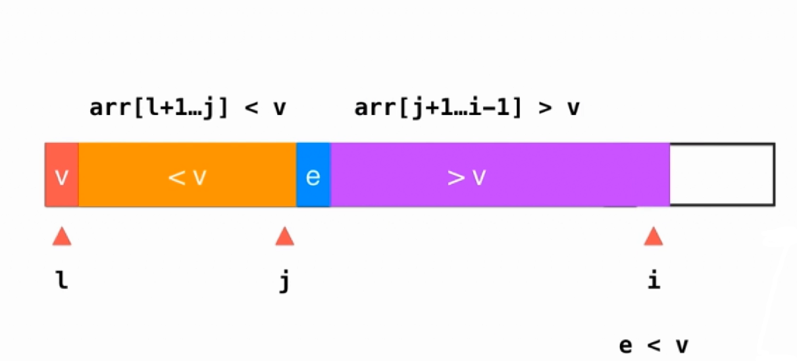
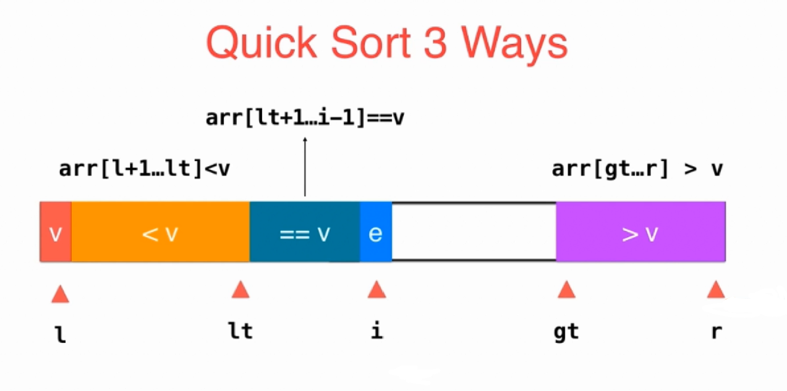

# 排序

# 1. 需要背的排序模板

## 1.1 快速排序

**基本款快排**



```java
public void quickSort(int[] arr, int l, int r) {
        if(l >= r) {
            return;
        }
        // swap(arr, l, (int)(Math.random()*(r-l+1)) + l);
        int v = arr[l];
        // [l +1, j] <= v   [j+1, i-1] > v
        int j = l;
        for(int i = l +1 ; i <= r; i++) {
            if(arr[i] <= v) {
                swap(arr, j+1, i);
                j++;
            }
        }
        swap(arr, l, j);
        quickSort(arr, l, j-1);
        quickSort(arr, j+1, r);
}

private void swap(int[] arr, int i, int j) {
        int temp = arr[i];
        arr[i] = arr[j];
        arr[j] = temp;
}
```


**三路快排**

当要排序的数中有很多重复的，三路快排性能会好很多



```java
 public void sortThreeWays(int[] arr, int l, int r) {
        if(l >= r) {
            return;
        }
        // swap(arr, l, (int)(Math.random()*(r-l+1)) + l );
        int v = arr[l];
        // [l, lt) < pivot [lt, i) = pivot   (gt, r] > pivot 初始 [l, l-1] [l,l] (r,r] 终止 [l, lt) [lt, gt] (gt, r]
        int lt = l;
        int gt = r;
        int i = l + 1; // i 当前需要判断的元素下标
        while(i <= gt) { //[l, lt) [lt, i) (gt, r] 当i == gt时，[l, lt) [lt, gt) (gt, r]并没有遍历完全部元素，所以需要在i == gt再循环一次
            if(arr[i] > v) {
                swap(arr, i, gt);
                gt--;
            } else if (arr[i] < v) {
                swap(arr, i, lt);
                lt++;
                i++;
            } else {
                i++;
            }
        }
        sortThreeWays(arr, l, lt-1);
        sortThreeWays(arr, gt+1, r);
 }

private void swap(int[] arr, int i, int j) {
        int temp = arr[i];
        arr[i] = arr[j];
        arr[j] = temp;
}
```


**快速排序的特殊用法：**

求top k，进行基本款快排，求出第k大元素后停止，时间复杂度O(n)


## 1.2 并归排序

```java
public class MergeSort {
    /**
     * 二路并归排序
     * @param arr
     */
    public static void sort(Comparable[] arr) {
        sort(arr, 0, arr.length-1);
    }

    private static void sort(Comparable[] arr, int l, int r) {
        if(l >= r) {
            return;
        }
        int mid = (r-l) /2 + l;
        sort(arr, l, mid);
        sort(arr, mid+1, r);
        merge(arr, l, mid, r);
    }

    private static void merge(Comparable[] arr, int l, int mid, int r) {
        int i = l;
        int j = mid +1;
        int k = 0;
        Comparable[] temp = new Comparable[r-l+1];
        while(i <= mid || j <=r) {
            if(i <= mid && j <=r) {
                if (arr[i].compareTo(arr[j]) < 0) {
                    temp[k] = arr[i];
                    i++;
                    k++;
                } else {
                    temp[k] = arr[j];
                    j++;
                    k++;
                }
            } else if(i <= mid) {
                temp[k] = arr[i];
                i++;
                k++;
            }  else {
                temp[k] = arr[j];
                j++;
                k++;
            }
        }
        for(i = 0; i < r - l +1; i++) {
            arr[l+i] = temp[i];
        }
    }


    /**
     * 原地并归排序
     * 核心思想便是“反转内存”的变体，即“交换两段相邻内存块”，
     * 例如
     *  A B C D E F  想要A B和 C D E F交换位置
     * [A B ] [C D E F]  分组反转 => [B A] [F E D C]  全部反转=> C D E F A B
     */
    public static void sortInPlace(Comparable[] arr) {
        sortInPlace(arr, 0, arr.length-1);
    }

    private static void sortInPlace(Comparable[] arr, int l, int r) {
        if(l >= r) {
            return;
        }
        int mid = (r-l) /2 +l;
        sortInPlace(arr, l, mid);
        sortInPlace(arr, mid+1, r);
        mergeInPlace(arr, l, mid, r);
    }

    private static void mergeInPlace(Comparable[] arr, int l, int mid, int r) {
        if( l > mid || mid >= r ) {
            return;
        }
        int i = l;
        int p = mid + 1, q = mid + 1;
        for(; i <= mid  ; i++) {
            if(arr[i].compareTo(arr[p])> 0) {
                break;
            }
        }
        for(; q <= r ; q++) {
            if(arr[q].compareTo(arr[i])> 0) {
                break;
            }
        }
        // [l, i) < arr[p]   [p, q) < arr[i]   反转 [i, mid] [p, q-1] [i, q-1]
        reverse(arr, i, mid);
        reverse(arr, p, q-1);
        reverse(arr, i, q-1);
        int move = (q-1) - p +1;
        l = i + move;
        mid += move;
        mergeInPlace(arr, l, mid, r );
    }

    private static void reverse(Comparable[] arr, int l , int r) {
        while(l < r) {
            Comparable temp = arr[l];
            arr[l] = arr[r];
            arr[r] = temp;
            l++;
            r--;
        }
    }

```


原地并归


# 2. 需要了解的排序

## 2.1 基础排序算法

### 2.1.1插入排序

```java
public class InsertionSort {

    /**
     * 插入排序
     * @param arr
     */
    public static void sort(Comparable[] arr) {
        int n = arr.length;
        for (int i = 0 ; i < n; i++ ) {
            for (int j = i; j > 0 && arr[j].compareTo(arr[j-1]) < 0; j--) {
                swap(arr, j-1, j);
            }
        }
    }


    private static void swap(Object[] arr, int i, int j) {
        Object tmp = arr[i];
        arr[i] = arr[j];
        arr[j] = tmp;
    }
}

```


### 2.1.2 希尔排序（特殊的插入排序）

```java
public class ShellSort {
    /**
     * 希尔排序(Shell's Sort)是插入排序的一种又称“缩小增量排序”（Diminishing Increment Sort），是直接插入排序算法的一种更高效的改进版本 （但此时不再稳定）。
     * 希尔排序是基于插入排序的以下两点性质而提出改进方法的(该方法实质上是一种分组插入方法)：
     * (1) 插入排序在对几乎已经排好序的数据操作时，效率高，即可以达到线性排序的效率。
     * (2) 但插入排序一般来说是低效的，因为插入排序每次只能将数据移动一位。
     * @param arr
     */
    public static void sort(Comparable[] arr) {
        for(int step = arr.length-1; step > 0; step /= 2) {
            for(int i = 0; i < arr.length; i+= step) {
                for(int j = i; j > 0 && arr[j].compareTo(arr[j-1]) < 0; j-= step) {
                    swap(arr, j-1, j);
                }
            }
        }
    }

    private static void swap(Object[] arr, int i, int j) {
        Object tmp = arr[i];
        arr[i] = arr[j];
        arr[j] = tmp;
    }
}

```


### 2.1.3 选择排序

```java
public class SelectionSort {

    /**
     * 选择排序
     * @param arr
     */
    public static void sort(Comparable[] arr) {
        int n = arr.length;
        for (int i = 0 ; i < n; i++) {
            // 每次循环查找[i, n-1]中的最小值，并把最小值与arr[i]交换
            int minIndex = i;
            for (int j = i; j < n;j++) {
                if(arr[j].compareTo(arr[minIndex]) < 0) {
                    minIndex = j;
                }
            }
            swap(arr,i, minIndex);
        }
    }

    /**
     * 两路选择排序
     * 优化思路，在每一轮中, 可以同时找到当前未处理元素的最大值和最小值
     * @param arr
     */
    public static void sortTwoWays(Comparable[] arr) {
        int l = 0;
        int r = arr.length-1;
        while(l < r) {
            // 每次循环查找[l, r]中的最小值、最大值，并把最小值与arr[l]交换、最大值与arr[r]交换
            int minIndex = l;
            int maxIndex = r;
            // 必须保证arr[minIndex] <= arr[maxIndex]，否则出现最大值出现在l，或者最小值出现在r，在swap时会出错
            // 例如 [3, 1] minIndex = 1, maxIndex = 0   swap(l, minIndex) swap(r, maxIndex) => [3, 1]
            if(arr[minIndex].compareTo(arr[maxIndex]) >0) {
                swap(arr, minIndex, maxIndex);
            }
            for(int i = l+1; i < r; i++) {
                if( arr[i].compareTo(arr[minIndex]) < 0) {
                    minIndex = i;
                } else if (arr[i].compareTo(arr[maxIndex]) > 0) {
                    maxIndex = i;
                }
            }
            swap(arr,l, minIndex);
            swap(arr,r,maxIndex);
            l++;
            r--;

        }

    }

    private static void swap(Comparable[] arr, int i, int j) {
        Comparable temp = arr[i];
        arr[i] = arr[j];
        arr[j] = temp;

    }
}
```


### 2.1.4 冒泡排序

```java
public class BubbleSort {

    /**
     * 冒泡排序-基础
     * @param arr
     */
    public static void sort(Comparable[] arr) {
        int n = arr.length;
        while (n>0) {
            for( int j = 1; j < n; j++) {
                if(arr[j-1].compareTo(arr[j]) >0) {
                    swap(arr, j-1, j);
                }
            }
            n--;
        }
    }

    /**
     * 冒泡排序-快速缩减n
     * @param arr
     */
    public static void sort2(Comparable[] arr) {

        int n = arr.length;
        while (n >0) {
            int nextN = 0;
            for (int i = 1 ;i < n;i++) {
                if(arr[i-1].compareTo(arr[i]) >0) {
                    swap(arr, i-1, i);
                    nextN = i; // 记录最后一次的交换位置, 在该元素之后均为有序
                    /*
                        为什么这里不是i-1 ？
                        当arr[i-1] > arr[i]，并进行了二者的交换后，此时arr[i-1] <= arr[i], 后续若不再交换，说明从[i, n-1]有序
                        但注意此时循环条件是i < n ，所以newN = i 实际下次循环的区间是[0, i-1]
                     */
                }
            }
            n = nextN;
        }

    }

    private static void swap(Object[] arr, int i, int j) {
        Object tmp = arr[i];
        arr[i] = arr[j];
        arr[j] = tmp;
    }
}
```


### 2.1.5 堆排序

```java
public class HeapSort {
    public static void sort(Comparable[] arr) {
        // 初始化堆
        int n = arr.length;
        for(int i = n / 2; i > 0; i--) {
            shiftDown(arr, i, n);
        }
        while(n >1) {
            swap(arr, 0, n-1);
            n--;
            shiftDown(arr, 1, n);
        }
    }


    /**
     * 向下调整元素
     * @param arr 保存堆的数组
     * @param index 调整元素序号（从1开始）
     * @param n 堆元素个数
     */
    private static void shiftDown(Comparable[] arr, int index,  int n) {
        if(index > n / 2) {
            return;
        }
        int left = 2 * index ;
        int right = 2 * index +1;
        int maxIndex = index;

        if(arr[left-1].compareTo(arr[maxIndex-1])> 0) {
            maxIndex = left;
        }
        if(right <= n && arr[right-1].compareTo(arr[maxIndex-1]) > 0) { // 右孩子不一定存在，需要判断
            maxIndex = right;
        }
        if(maxIndex != index) {
            swap(arr, maxIndex-1, index-1);
            shiftDown(arr, maxIndex, n);
        }
    }

   private static void swap(Comparable[] arr, int i, int j) {
        Comparable temp = arr[i];
        arr[i] = arr[j];
        arr[j] = temp;

    }
}

```


## 2.2 特殊排序算法（线性时间复杂度）

### 2.2.1 桶排序

适用于：排序的数字个数远大于数的值域，时间复杂度O(n)

```java
public class BucketSort {
    public static void sort(Integer[] arr) {
        int max = arr[0];
        int min = arr[0];
        for(int i = 1; i < arr.length; i++) {
            if(arr[i] >max) {
                max = arr[i];
            }else if(arr[i] < min) {
                min = arr[i];
            }
        }
        int bucketNum = arr.length / 10 > 1? arr.length / 10 : 1;
        int bucketRange = (max - min) / bucketNum + 1; // 需要向上取整或者原值+1，保证后续运算时最大值的桶下标是bucketNum-1
        List<List<Integer>> buckets = new ArrayList<>(bucketNum);
        for(int i = 0; i < bucketNum; i++) {
            buckets.add(new ArrayList<>());
        }
        for(int i =0; i<arr.length; i++) {
            int index = (arr[i] - min) / bucketRange;
            List<Integer> bucket = buckets.get(index);
            bucket.add(arr[i]);
        }
        for(int i =0 ; i < buckets.size(); i++) {
            Collections.sort(buckets.get(i));
        }
        int k = 0;
        for(int i =0; i < buckets.size();i++) {
            List<Integer> bucket = buckets.get(i);
            for(int j= 0; j <bucket.size();j++) {
                arr[k] = bucket.get(j);
                k++;
            }
        }
    }
}
```


### 2.2.2 计数排序（桶排序的特例）

适用于：排序的数字个数远大于数的值域，时间复杂度O(n)

```java
public class CountingSort {
    /**
     * 计数排序是桶排序的一种特例，每个桶至多只对应一个数字，并且把往桶里放数字变为记录该数字出现次数
     * @param arr
     */
    public static void sort(Integer[] arr) {
        int max = arr[0];
        int min = arr[0];
        for(int i = 0; i < arr.length; i++) {
            if(arr[i] > max) {
                max = arr[i];
            } else if(arr[i] < min) {
                min = arr[i];
            }
        }
        int[] count = new int[max-min+1];
        for(int i = 0; i < arr.length; i++) {
            count[arr[i] -min]++;
        }
        for(int i = 0, j = 0; i < count.length;i++) {
            for(int k = 0; k < count[i];  k++, j++) {
                arr[j] = i + min;
            }
        }
    }

}
```


### 2.2.3 基数排序（仅适合整数）

时间复杂度O(mn)  其中m为数字最大位数，n为排序的数字个数

m决定排序几次，每次排序O(n)的桶排序

```java
public class RadixSort {
    /**
     * 基数排序，默认输入均为正整数
     * @param arr
     */
    public static void sort(Integer[] arr) {
        int digits = maxDigits(arr);
        List<List<Integer>> buckets = new ArrayList<>();
        for(int i = 0; i < 10;i++) {
            buckets.add(new ArrayList<>());
        }
        for(int i = 0; i < digits; i++) {
            // 按第i+1位排序
            for(int j = 0; j < arr.length; j++) {
                int num = 10 * i > 0 ? 10 * i : 1;
                buckets.get(arr[i] / num % 10).add(arr[i]);
            }
            // 排序后写回原数组
            int k = 0;
            for(int p =0; p < buckets.size();p++) {
                List<Integer> bucket = buckets.get(p);
                for(int q =0; q < bucket.size();q++) {
                    arr[k] = bucket.get(q);
                    k++;
                }
                bucket.clear();
            }
        }
    }

    private static int maxDigits(Integer[] arr) {
        int max = arr[0];
        for(int i = 0; i < arr.length; i++) {
            if(arr[i] > max) {
                max = arr[i];
            }
        }
        int digits = 0;
        do {
            max = max / 10;
            digits++;
        } while (max > 0);
        return digits;
    }
}

```


# 2 稳定性

**选择-快排-希尔-堆，不稳定。**