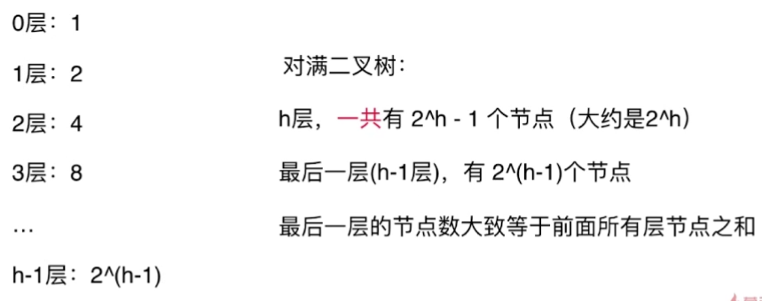

# 线段树

## 1. 基本模型

**在固定长度的区间进行更新、查询某些指标（线段树不考虑添加元素）**


**每个节点存储一段区间和**


## 2. 数组长度与数节点个数关系推导

线段树虽然不是满二叉树，但是可以把它当成满二叉树去开空间。

对于h层的满二叉树：




（1）最好情况：若元素个数恰好可以构成满二叉树，即n = 2<sup>k</sup>，

则h = log<sub>2</sub>n + 1 = k +1

需要节点个数 = 2<sup>h</sup>-1 = 2<sup>k+1</sup> -1   = 2 *2<sup>k</sup> -1 ≈ 2n


（2）最差情况：若元素个数恰好n = 2<sup>k</sup> +1

比最好情况多一个节点导致多出一层，这一层只有一个节点，但为了当成满二叉树还得开一层。

根据上面分析，最后多出一层的节点个数约等于前面所有的，最后一层也等于2n

综上，最差情况需要4n


备注：若要不浪费空间，要么很麻烦的计算到底数据开多少个，要么构建TreeNode使用离散结构存储

## 3. 基础模板

https://leetcode-cn.com/problems/range-sum-query-mutable/

```java
class SegmentTree {
    private int[] data;
    private int[] tree;

    SegmentTree(int[] data) {
        this.data = data;
        this.tree = new int[4 * data.length];
        buildSegmentTree(0, 0, data.length - 1);
    }

    private void buildSegmentTree(int treeIndex, int l, int r) {
        if (l > r) {
            return;
        }

        if (l == r) {
            tree[treeIndex] = data[l];

            return;
        }
        int mid = l + ((r - l) / 2);
        int leftChild = (treeIndex * 2) + 1;
        int rightChild = (treeIndex * 2) + 2;
        buildSegmentTree(leftChild, l, mid);
        buildSegmentTree(rightChild, mid + 1, r);
        tree[treeIndex] = tree[leftChild] + tree[rightChild];
    }

    public int query(int queryL, int queryR) {
        if ((queryL <= queryR) && (queryL >= 0) && (queryR < data.length)) {
            return query(0, 0, data.length - 1, queryL, queryR);
        }

        return 0;
    }

    private int query(int treeIndex, int l, int r, int queryL, int queryR) {
        if ((l == queryL) && (r == queryR)) {
            return tree[treeIndex];
        }

        int mid = l + ((r - l) / 2);
        int leftChild = (2 * treeIndex) + 1;
        int rightChild = (2 * treeIndex) + 2;

        if (queryL > mid) {
            return query(rightChild, mid + 1, r, queryL, queryR);
        } else if (queryR <= mid) {
            return query(leftChild, l, mid, queryL, queryR);
        } else {
            return query(leftChild, l, mid, queryL, mid) +
            query(rightChild, mid + 1, r, mid + 1, queryR);
        }
    }

    public void update(int updateL, int updateR, int target) {
        if ((updateL <= updateR) && (updateL >= 0) && (updateR < data.length)) {
            update(0, 0, data.length - 1, updateL, updateR, target);
        }
    }

    private void update(int treeIndex, int l, int r, int updateL, int updateR,
        int target) {
        if ((l == r) && (updateL == updateR) && (l == updateL) &&
                (r == updateR)) {
            data[l] = target;
            tree[treeIndex] = target;

            return;
        }

        int mid = l + ((r - l) / 2);
        int leftChild = (treeIndex * 2) + 1;
        int rightChild = (treeIndex * 2) + 2;

        if (updateL > mid) {
            update(rightChild, mid + 1, r, updateL, updateR, target);
        } else if (updateR <= mid) {
            update(leftChild, l, mid, updateL, updateR, target);
        } else {
            update(leftChild, l, mid, updateL, mid, target);
            update(rightChild, mid + 1, r, mid + 1, updateR, target);
        }

        tree[treeIndex] = tree[leftChild] + tree[rightChild];
    }
}

```


## 4. 例题

https://leetcode-cn.com/problems/range-sum-query-immutable/ 

https://leetcode-cn.com/problems/range-sum-query-mutable/

https://leetcode-cn.com/problems/range-sum-query-2d-immutable/

https://leetcode-cn.com/problems/range-sum-query-2d-mutable/