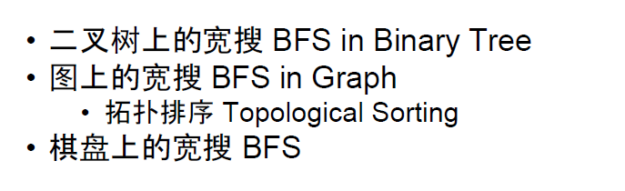
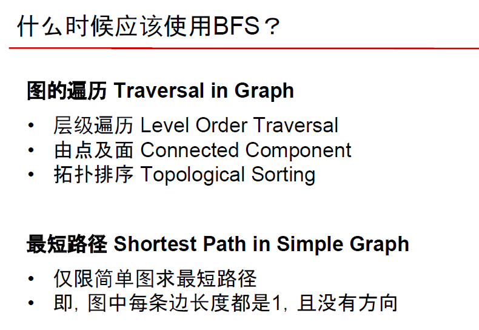

# 广度优先遍历Breadth First Search





## 1.基础模板

**需要注意的关键点**：

- **使用队列作为主要的数据结构Queue**

- **是否需要实现分层（需要分的算法要多一个循环）**

  **size = queue.size()**

  **for(int i =0 ;i < size;i++)**

- **能用BFS一定不用DFS**


### 1.1 二叉树BFS

https://www.lintcode.com/problem/binary-tree-level-order-traversal/description

```java
/**
 * Definition of TreeNode:
 * public class TreeNode {
 *     public int val;
 *     public TreeNode left, right;
 *     public TreeNode(int val) {
 *         this.val = val;
 *         this.left = this.right = null;
 *     }
 * }
 */

public class Solution {
    /**
     * @param root: A Tree
     * @return: Level order a list of lists of integer
     */
    public List<List<Integer>> levelOrder(TreeNode root) {
        // write your code here
        List<List<Integer>> res = new ArrayList<>();
        
        Queue<TreeNode> queue = new LinkedList<>();
        if(root != null) {
            queue.add(root);
        }
        while(!queue.isEmpty()) {
            int size = queue.size();
            List<Integer> currentLevel = new ArrayList<>();
            for(int i = 0; i < size ; i++) {
                TreeNode head = queue.poll();
                currentLevel.add(head.val);
                if(head.left != null) {
                    queue.add(head.left);
                }
                if(head.right != null) {
                    queue.add(head.right);
                }
            }
            res.add(currentLevel);
        }
        return res;
    }
}
```


### 1.2 图BFS

#### 1.2.1 一般图BFS

**与二叉树BFS区别:**

- **可能存在环，导致同一个节点可能重复进入队列**
- **需要使用HashSet或HashMap记录已经访问的节点，避免重复遍历**


如何简便的表示一个图

```java
// 稀疏图
Map<Integer, Set<Integer>> graph = new HashMap<>();

// 稠密图
int[][] graph = new int[N][N];

// 向图中添加一个边，需要考虑是有向图，还是无向图
```


https://www.lintcode.com/problem/search-graph-nodes/description

```java
/**
 * Definition for graph node.
 * class UndirectedGraphNode {
 *     int label;
 *     ArrayList<UndirectedGraphNode> neighbors;
 *     UndirectedGraphNode(int x) { 
 *         label = x; neighbors = new ArrayList<UndirectedGraphNode>(); 
 *     }
 * };
 */


public class Solution {
    /*
     * @param graph: a list of Undirected graph node
     * @param values: a hash mapping, <UndirectedGraphNode, (int)value>
     * @param node: an Undirected graph node
     * @param target: An integer
     * @return: a node
     */
    public UndirectedGraphNode searchNode(ArrayList<UndirectedGraphNode> graph,
                                          Map<UndirectedGraphNode, Integer> values,
                                          UndirectedGraphNode node,
                                          int target) {
        // write your code here
        Queue<UndirectedGraphNode> queue = new LinkedList<>();
        Set<UndirectedGraphNode> visited = new HashSet<>();
        visited.add(node);
        queue.add(node);
        while(!queue.isEmpty()) {
            UndirectedGraphNode head = queue.poll();
            if(values.get(head) == target) {
                return head;
            }
            ArrayList<UndirectedGraphNode> neighbors = head.neighbors;
            for(UndirectedGraphNode neighbor: neighbors) {
                if(!visited.contains(neighbor)) {
                    visited.add(neighbor);
                    queue.add(neighbor);
                }
            }
        }
        return null;
    }
}
```


#### 1.2.2 有向无环图BFS求拓扑排序

DAG （Directed acyclic graph）有向无环图指的是一个无回路的有向图。

**关键点：**

- **需要统计每个节点入度，**
- **每次循环先把当前节点指向的节点入度减一，再把当前入度为0的节点加入队列**
- **由于DAG中没有环，所以不用出现重复访问节点的问题**


https://www.lintcode.com/problem/topological-sorting/description

```java
/**
 * Definition for Directed graph.
 * class DirectedGraphNode {
 *     int label;
 *     ArrayList<DirectedGraphNode> neighbors;
 *     DirectedGraphNode(int x) { label = x; neighbors = new ArrayList<DirectedGraphNode>(); }
 * };
 */

public class Solution {
    /*
     * @param graph: A list of Directed graph node
     * @return: Any topological order for the given graph.
     */
    public ArrayList<DirectedGraphNode> topSort(ArrayList<DirectedGraphNode> graph) {
        // write your code here
        ArrayList<DirectedGraphNode> res = new ArrayList<>();
        Map<DirectedGraphNode, Integer> map = new HashMap<>();
        for(int i =0 ; i < graph.size(); i++) {
            DirectedGraphNode node = graph.get(i);
            for(DirectedGraphNode neighbor: node.neighbors) {
                int indegree = map.getOrDefault(neighbor, 0);
                indegree++;
                map.put(neighbor, indegree);
            }
        }
        Queue<DirectedGraphNode> queue = new LinkedList<>();
       
        for(int i =0; i < graph.size();i++) {
            DirectedGraphNode node = graph.get(i);
            if(!map.containsKey(node)) {
                queue.add(node);
                
            }
        }
        while(!queue.isEmpty()) {
            DirectedGraphNode head = queue.poll();
            res.add(head);
            for(DirectedGraphNode neighbor: head.neighbors) {
                int indegree = map.get(neighbor);
                indegree--;
                if(indegree == 0) {
                    queue.add(neighbor);
                }
                map.put(neighbor, indegree);
            }
        }
        return res;
    }
}
```


#### 1.3 矩阵中的广度优先搜索

**关键点：**

- **避免重复遍历，需要用boolean\[\]\[\]记录已经访问的节点（坐标）或者直接修改原图为不可遍历值）**

- **使用坐标变换数组，避免需要手动写一堆If else**

  **int[] deltaX = {1,0,0,-1};**
  **int[] deltaY = {0,1,-1,0};**

- **使用inBound函数判断移动坐标是否合法**

https://www.jiuzhang.com/solutions/number-of-islands/

```java
public class Solution {
    /**
     * @param grid: a boolean 2D matrix
     * @return: an integer
     */
    public int numIslands(boolean[][] grid) {
        // write your code here
        
        int m = grid.length;
        if( m == 0) {
            return 0;
        }
        int n = grid[0].length;
        int res = 0;
        for(int i = 0; i < m; i++) {
            for(int j =0; j < n; j++) {
                if(grid[i][j]) {
                    bfs(grid, i, j);
                    res++;
                }
            }
        }
        return res;
    }
    
    private class Coordinate {
        int x, y;
        public Coordinate(int x, int y) {
            this.x = x;
            this.y = y;
        }
    }
    
    private void bfs(boolean[][] grid, int x, int y) {
        int[] deltaX = new int[]{-1, 1, 0, 0};
        int[] deltaY = new int[]{0, 0, -1, 1};
        
        grid[x][y] = false;
        Queue<Coordinate> queue = new LinkedList<>();
        queue.add(new Coordinate(x, y));
        
        while(!queue.isEmpty()) {
            Coordinate coor = queue.poll();
            for(int i = 0; i < 4; i++) {
                int nextX = coor.x + deltaX[i];
                int nextY = coor.y + deltaY[i];
                if(!inBound(grid, nextX, nextY)) {
                    continue;
                }
                if(grid[nextX][nextY]) {
                    grid[nextX][nextY] = false;
                    queue.add(new Coordinate(nextX, nextY));
                }
            }
        }
    }
    
    private boolean inBound(boolean[][] grid, int x, int y) {
        int m = grid.length;
        int n = grid[0].length;
        return x >= 0 && x < m && y >=0 && y < n;
    }
}
```


## 2. 例题

###  二叉树

http://www.lintcode.com/problem/binary-tree-level-order-traversal/

http://www.lintcode.com/en/problem/binary-tree-level-order-traversal-ii/

http://www.lintcode.com/en/problem/binary-tree-serialization/ **二叉树序列化**

http://www.lintcode.com/en/problem/binary-tree-zigzag-level-order-traversal/

http://www.lintcode.com/en/problem/convert-binary-tree-to-linked-lists-by-depth/


### 一般图

http://www.lintcode.com/problem/graph-valid-tree/

http://www.lintcode.com/problem/clone-graph/ **深拷贝图（mapping的用法）**

http://www.lintcode.com/problem/search-graph-nodes/

### DAG图

http://www.lintcode.com/problem/topological-sorting/

http://www.lintcode.com/en/problem/course-schedule/ 

http://www.lintcode.com/problem/course-schedule-ii/

http://www.lintcode.com/problem/sequence-reconstruction/

### 矩阵

http://www.lintcode.com/problem/number-of-islands/

http://www.lintcode.com/problem/zombie-in-matrix/

http://www.lintcode.com/problem/knight-shortest-path/

http://www.lintcode.com/problem/connected-component-in-undirected-graph/ 无向图联通块

http://www.lintcode.com/problem/word-ladder/ 单词阶梯

http://www.lintcode.com/en/problem/build-post-office-ii/ 建邮局问题