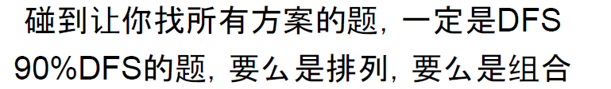
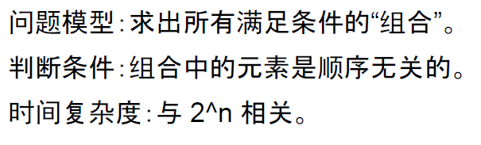
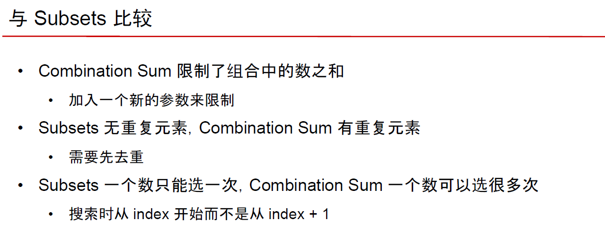

# 深度优先搜索Depth First Search





**主要有以下几类问题：**

- **组合**
- **排列**
- **图**


**关键点：**

- **推荐用递归实现**
- **若必须用非递归，需要使用栈Stack**


## 1. 基础模板

## 1.1 组合

https://www.lintcode.com/problem/subsets/description

```java
public class Solution {
    /**
     * @param nums: A set of numbers
     * @return: A list of lists
     */
    public List<List<Integer>> subsets(int[] nums) {
        // write your code here
        List<List<Integer>> res = new ArrayList<>();
        
        if(nums == null ) {
            return res;
        }
        if(nums.length == 0) {
            res.add(new ArrayList<>());
            return res;
        }
        Arrays.sort(nums);
        dfs(nums, 0, new ArrayList<>(), res);
        return res;
        
    }
    // 递归三要素
    // 1. 递归的定义：在 Nums 中找到所有以 subset 开头的集合，并放到 res
    private void dfs(int[] nums, int startIndex, List<Integer> subset,
    List<List<Integer>> res) {
        
        // 2. 递归的拆解
        // deep copy
        // res.add(subset);
        res.add(new ArrayList<>(subset)); // 深拷贝当前选中的数
        
        
        for(int i = startIndex; i < nums.length; i++) { // 递归条件
            subset.add(nums[i]);
            dfs(nums, i+1, subset, res);
            subset.remove(subset.size() -1);
        }
        
        // 3. 递归的出口
        // return;
    }
  
}
```


## 1.2 排列

https://www.lintcode.com/problem/permutations/description

```java
/*
     * @param nums: A list of integers.
     * @return: A list of permutations.
     */
    public List<List<Integer>> permute(int[] nums) {
        List<List<Integer>> res = new ArrayList<>();
        if (nums == null) {
            return res;
        }
        
        dfs(nums, new boolean[nums.length], new ArrayList<Integer>(), res);
        
        return res;
    }
    
    private void dfs(int[] nums, boolean[] visited, List<Integer> permutation,
                     List<List<Integer>> res) {
        if (nums.length == permutation.size()) {
            res.add(new ArrayList<Integer>(permutation));
            return;
        }
        
        for (int i = 0; i < nums.length; i++) {
            if (visited[i]) {
                continue;
            }  
            permutation.add(nums[i]);
            visited[i] = true;
            dfs(nums, visited, permutation, res);
            visited[i] = false;
            permutation.remove(permutation.size() - 1);
        }
    }
}
```


## 1.3 图

https://www.lintcode.com/problem/word-ladder/description 


## 2. 例题


### 组合

https://www.lintcode.com/problem/subsets/description 子集

https://www.lintcode.com/problem/subsets-ii/description 有重复元素子集

https://www.lintcode.com/problem/combination-sum/ 子集和（数字可用无限次）

https://www.lintcode.com/problem/combination-sum-ii/description 子集和（数字只能用一次）



https://www.lintcode.com/problem/palindrome-partitioning/description 分割回文串


### 排列

https://www.lintcode.com/problem/permutations/description 全排列

http://www.lintcode.com/problem/permutations-ii/description 全排列（包含重复元素）

https://www.lintcode.com/problem/n-queens/description 八皇后 （如何在二维矩阵判断两点在一条直线上）


### 图

https://www.lintcode.com/problem/word-ladder/description 

https://www.lintcode.com/problem/word-ladder-ii/description

实际上面两题用bfs更好

