# 什么是动态规划

给定一个矩阵网络，一个机器人从左上角出发，每次可以向下或向右走一步


题A：求有多少种方式走到右下角（动态规划）

题B：输出所有走到右下角的路径（递归+dfs）


## 动态规划题目特点

1. 计数
   - 有多少种方式走到右下角
   - 有多少种方法选出k个数使得和是Sum
2. 求最大最小值
   - 从左上角走到右下角路径和的最大数字和
   - 最长上升子序列长度
3. 求存在性
   - 取石子游戏，先手是否必胜
   - 能不能选出k个数使得和是Sum


例题1：

LintCode 669: Coin Change

- 你有三种硬币，分别面值2元，5元和7元，每种硬币都有足够多
- 买一本书需要27元
- 如何用**最少**的硬币组合正好付清，不需要对方找钱


解：求最大最小型动态规划

直觉：

- 最小硬币组合 - > 尽量用面值大的硬币
- 7 + 7 + 7 = 21   
- 21+5 =26 无法继续求解

修改：

- 尽量用大的硬币，最后如果可以用一种硬币付清就行
- 7 + 7 + 7 = 21
- 21 + 2 + 2 + 2 = 27

但正确答案是：7 + 5 + 5 + 5 = 27   5枚硬币


## 动态规划组成部分一：确定状态

- 状态在动态规划中的作用属于定海神针
- 简单的说，解动态规划的时候需要开一个数组，每个数组元素dp\[i\]或dp\[i\]\[j\]代表什么
  - 类似于解数学题中，X，Y，Z代表什么
- 确定状态需要两个意识：
  - 最后一步
  - 子问题

### 最后一步

- 虽然我们不知道最优策略是什么，但是最优策略肯定是k枚硬币a<sub>1</sub>,a<sub>2</sub>, ...., a<sub>k</sub>面值加起来是27
- 所以一定有一枚最后的硬币：a<sub>k</sub>
- 除掉这枚硬币，前面的硬币面值加起来是27-a<sub>k</sub>

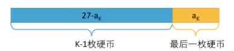

**关键点1**

我们不关心前面的k-1枚硬币是怎么拼出27-a<sub>k</sub>的（可能有1种拼法，可能有100种拼法），而且我们现在甚至不知道a<sub>k</sub>和k，但是我们确定前面的硬币拼出了27-a<sub>k</sub>


**关键点2**

因为是最优策略，所以拼出的27-a<sub>k</sub>的硬币数一定要最少，否则这就不是最优策略了


### 子问题

- 所以我们就把原来的问题转化为一个更小的问题：最少用多少枚硬币可以拼出27-a<sub>k</sub>
- dp\[27\] -> dp\[27-a<sub>k</sub>\]
- 最后那枚硬币并不知道是多少，所以2,5或7全部要尝试一次
- 如果a<sub>k</sub>是2，dp\[27\]   =  dp\[25\] + 1 
- 如果a<sub>k</sub>是5，dp\[27\]   =  dp\[22\] + 1 
- 如果a<sub>k</sub>是7，dp\[27\]   =  dp\[20\] + 1 
- 所以：dp\[27\]   =  min{dp\[25\] + 1 , dp\[22\] + 1 , dp\[20\] + 1 }

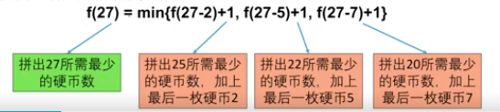

直接递归解法会产生冗余计算（子问题重叠）：

```java
private int dp(int n) {
    if(n == 0) return 0;
    int res = Integer.MAX_VALUE;
    if(n >=2) {
        res = Math.min(dp[n-2]+1, res);
    }
    if(n >=5) {
        res = Math.min(dp[n-2]+1, res);
    }
    if(n >=7) {
        res = Math.min(dp[n-2]+1, res);
    }
    return res;
}
```

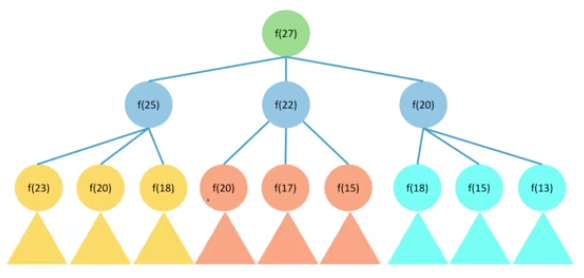

如何避免重复计算：

- 将计算结果保存下来

- 改变计算顺序

  

## 动态规划组成部分二：转移方程

- 设状态dp\[i\] = 最少用多少枚硬币拼出n
- 对于任意n，dp\[n\]   =  min{dp\[n-2\] + 1 , dp\[n-5\] + 1 , dp\[n-7\] + 1 }


## 动态规划组成部分三：初始条件和边界情况

- dp\[n\]   =  min{dp\[n-2\] + 1 , dp\[n-5\] + 1 , dp\[n-7\] + 1 }
- 两个问题：n-2，n-5,或n-7小于0怎么办？什么时候停下来
- 如果不能拼出n，就定义dp\[n\] = 正无穷
  - 例如dp\[-1\]=dp\[-2\]=... = 正无穷
- 所以dp\[1\]   =  min{dp\[-1\] + 1 , dp\[-4\] + 1 , dp\[-6\] + 1 } = 正无穷，表示拼不出n=1
- 初始条件dp\[0\] = 0


## 动态规划组成部分四：计算顺序

- 拼出n所需的最小硬币数：dp\[n\]   =  min{dp\[n-2\] + 1 , dp\[n-5\] + 1 , dp\[n-7\] + 1 }
- 初始条件：dp\[0\] = 0
- 然后计算dp\[1\],dp\[1\],...,dp\[27\]
- 当我们计算到dp\[n\]时，dp\[n-2\]  , dp\[n-5\]  , dp\[n-7\] 都已经得到结果了

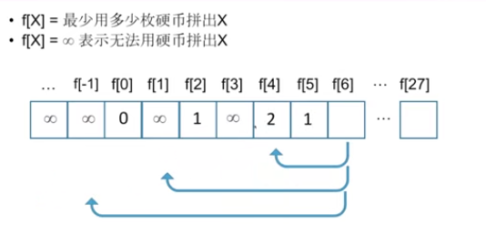

- 每一步尝试三种硬币，一共27步
- 没有任何重复计算，算法时间复杂度：O(n)


小结：求最值型动态规划

- 动态规划组成部分：
  1. 确定状态
     - 最后一步（最优策略中使用的最后一枚硬币a<sub>k</sub>）
     - 转化为子问题（最少的硬币拼出更小的面试27-a<sub>k</sub>）
  2. 转移方程
     - dp\[n\]   =  min{dp\[n-2\] + 1 , dp\[n-5\] + 1 , dp\[n-7\] + 1 }
  3. 初始条件和边界情况
     - dp\[0\] = 0 , 如果拼不出n，dp\[n\] = 正无穷
  4. 计算顺序
     - dp\[0\],dp\[1\],dp\[2\]

- 重叠的子问题只计算一次，加速计算

```java
public class Solution {
    /**
     * @param coins: a list of integer
     * @param amount: a total amount of money amount
     * @return: the fewest number of coins that you need to make up
     */
    public int coinChange(int[] coins, int amount) {
        // write your code here
        int[] dp = new int[amount+1];
        int n = coins.length;
        dp[0] = 0;
        for(int i = 1; i <= amount; i++) {
            dp[i] = Integer.MAX_VALUE;
            for(int j= 0; j < n; j++) {
                if(i- coins[j] >= 0 && dp[i-coins[j]] < Integer.MAX_VALUE) {
                    dp[i] = Math.min(dp[i], dp[i-coins[j]] + 1);
                }
            }
        }
        return dp[amount] < Integer.MAX_VALUE? dp[amount]: -1;
    }
}
```


练习题：

1. LintCode 114: Unique Paths

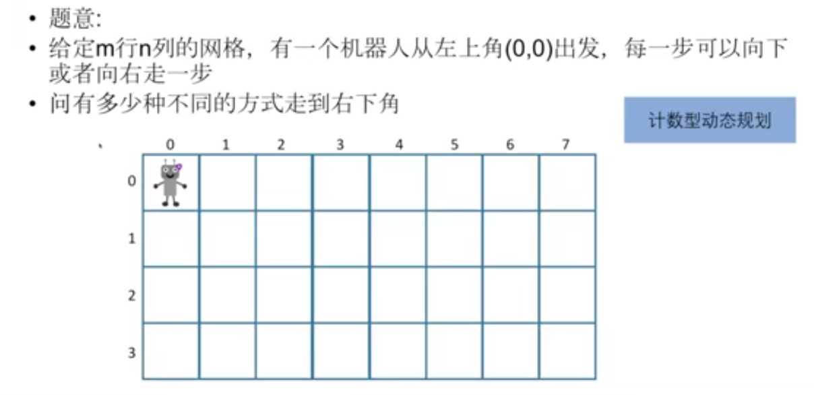


```java
public class Solution {
    /**
     * @param m: positive integer (1 <= m <= 100)
     * @param n: positive integer (1 <= n <= 100)
     * @return: An integer
     */
    public int uniquePaths(int m, int n) {
        // write your code here
        int[][] dp = new int[m][n];
        dp[0][0] = 1;
        for(int i =0; i<m; i++) {
            for(int j = 0; j < n; j++) {
                if(j-1 >=0) {
                    dp[i][j] += dp[i][j-1];
                }
                if(i-1 >=0) {
                    dp[i][j] += dp[i-1][j];
                }
            }
        }
        return dp[m-1][n-1];
    }
}
```


2. LintCode 116 Jump Game

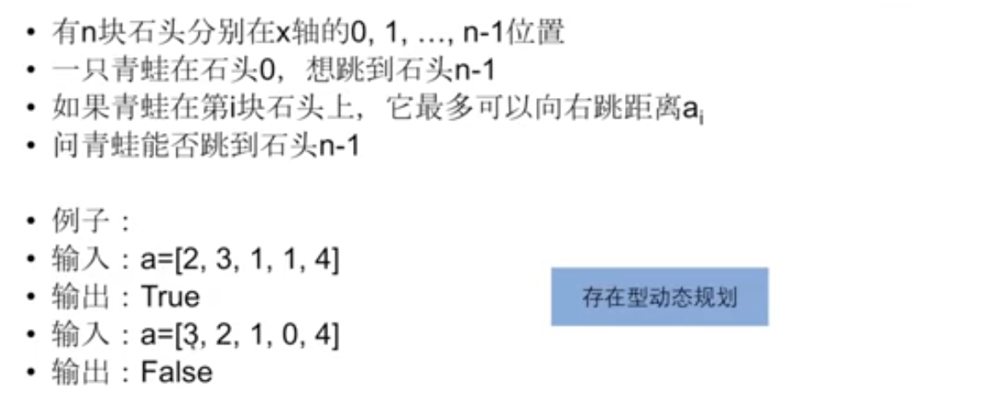

```java
public class Solution {
    /**
     * @param A: A list of integers
     * @return: A boolean
     */
    public boolean canJump(int[] A) {
        // write your code here
        int n = A.length;
        boolean[] dp = new boolean[n];
        dp[0] = true;
        for(int i = 1; i< n;i++) {
            for(int j= i-1; j>=0; j--) {
                if(dp[j] && A[j] >= i-j) {
                    dp[i] = true;
                    break;
                }
            }
        }
        return dp[n-1];
    }
}
```

扩展：LintCode 117 Jump Game II


3. LintCode 191 Maximum Product Subarray

找出一个序列中乘积最大的连续子序列（至少包含一个数）。 **最值型动态规划**

注意：**连续的子序列** 等价于**子数组**，看到子序列还是要再看下定语

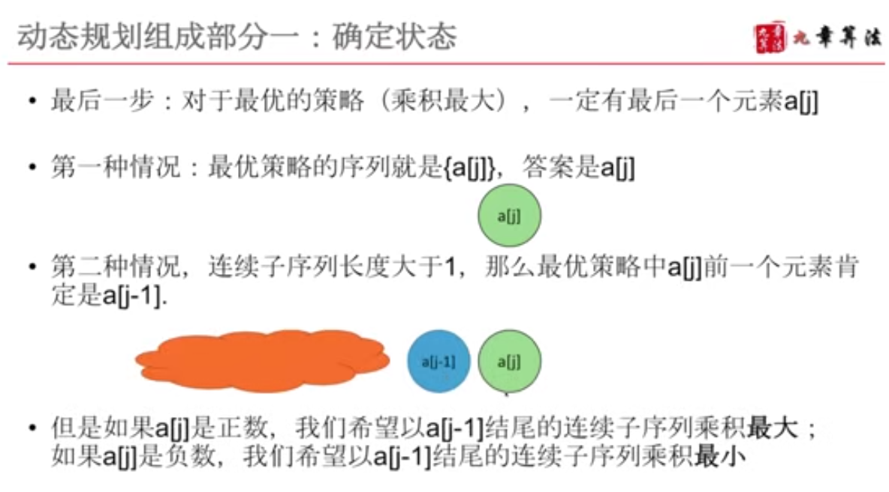

**这里关键在于最后一步是什么，因为并不是一定要到n，可能是任意一个元素j，所以这里的定义需要注意理解一下**


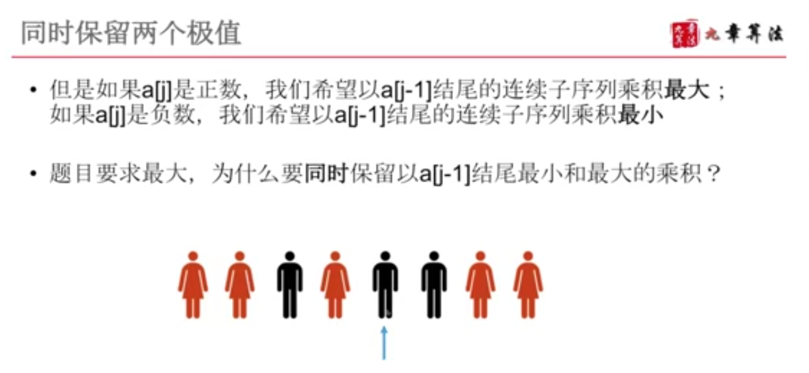

以非诚勿扰相亲为例，男女交替排列，每个人都要找左侧颜值最高的异性，解这个动态规划就需要同时保留0-i之间颜值最高的男性、颜值最高的女性

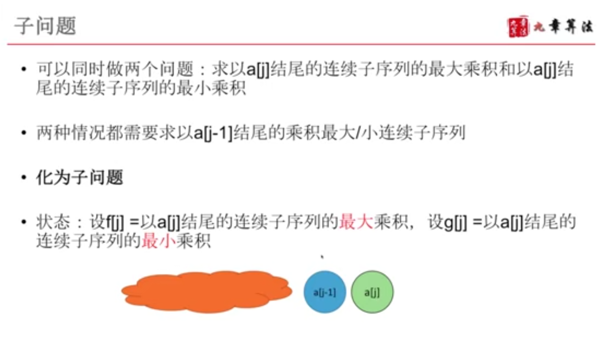

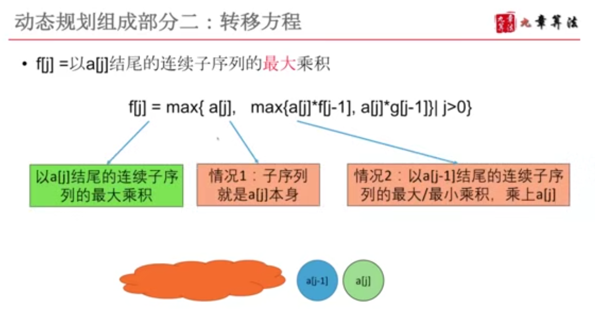

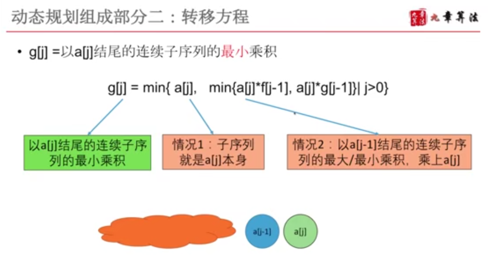

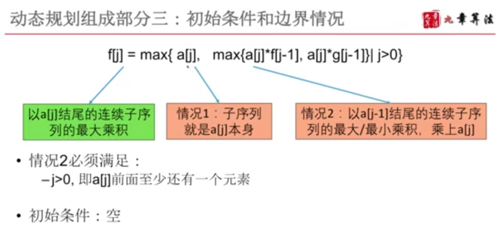

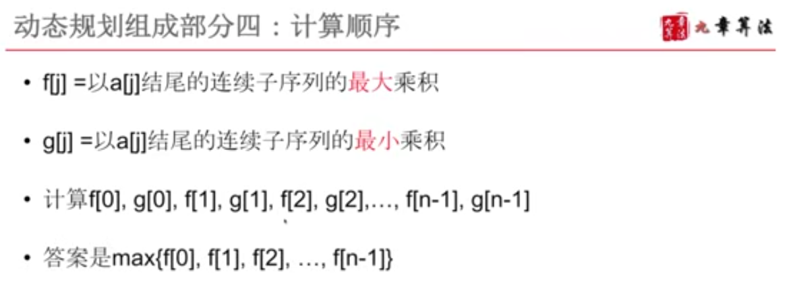

```java
public class Solution {
    /**
     * @param nums: An array of integers
     * @return: An integer
     */
    public int maxProduct(int[] nums) {
        // write your code here
        int n = nums.length;
        int[] max = new int[n]; // max[i] 以 nums[i]结尾的连续子序列最大值
        int[] min = new int[n]; // min[i] 以 nums[i]结尾的连续子序列最小值
        max[0] = nums[0];
        min[0] = nums[0];
        for(int i = 1; i < n; i++) {
            max[i] = Math.max(nums[i], Math.max(nums[i] * max[i-1], nums[i] * min[i-1]));
            min[i] = Math.min(nums[i], Math.min(nums[i] * max[i-1], nums[i] * min[i-1]));
        }
        int res = Integer.MIN_VALUE;
        for(int i = 0; i <n ;i++) {
            res = Math.max(res, max[i]);
        }
        return res;
       
    }
}
```


# 动态规划入门总结

## 1. 确定状态

- 研究最优策略的最后一步（若最后一步不确定在哪，可以假设以j为最后一步去分析）
- 化为子问题

## 2. 转移方程

- 根据子问题定义直接得到

## 3. 初始条件和边界情况

- 细心、考虑周全（边界0，或者dp\[i\]是不合法情况，无穷小，无穷大）

## 4. 计算顺序

- 利用之前的计算结果，自下向上计算


# 常见动态规划类型

- 坐标型
- 序列型
- 划分型
- 区间型
- 背包型
- 最长序列型
- 博弈型
- 综合型