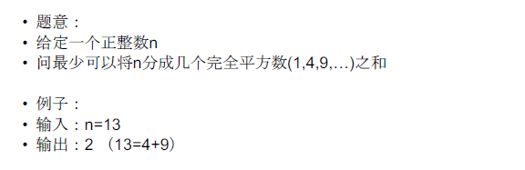
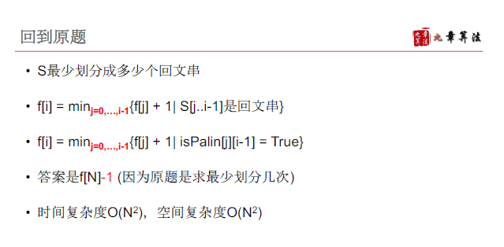

# 划分型动态规划


## 基本特征和解题思路

给定长度为N的序列或者字符串，要求划分成若干段

- 段数不限，或指定K段
- 每一段满足一定的性质


解题思路：

- 枚举最后一段（一步）的起点，类似于序列型动态规划，但是可能要加上段数信息

- 如果题目不指定段数，一般用f\[i\]记录前i个元素分段后的可行性/最值，例1 例2

- 如果题目指定段数，一般用f\[i\]\[j\]记录前i个元素（元素下标0~i-1）分成j段后的可行性/最值，如例3

  

### 例1 [LintCode 513 Perfect Squares](https://www.lintcode.com/problem/perfect-squares/)




补充：

```
时间复杂度推导：
该题时间复杂度是O(n^1.5) // O（n*根号n）

f[i] = min {f[i-j^2] +1}{1<= j<=i}
由于要从1-n每个数都计算一次，所以第一个n有了
关键在于计算每个数的时候的时间复杂度，这里i是以完全平方增长的，使用不等式求上下限
1<= j <= 根号i <= 根号n
i  j
1  [1]
2  [1]
3  [1] 
4  [1 2]
5  [1 2]
6  [1 2]
...
i  [1, 2, 3, 4, 根号i]

上限：令根号i = 根号n，则尝试每个数j的遍历次数都是根号n，所以上限时间复杂度O（n*根号n）
下限：令根号i = 根号n/4（找一些方便计算的特例，确保取下限时的计算次数小于实际计算次数）(j [1, 根号n/2])，所以下限时间复杂度O(n*根号n/2)

综上，时间复杂度是O（n*根号n）

```


```java
public class Solution {
    /**
     * @param n: a positive integer
     * @return: An integer
     */
    public int numSquares(int n) {
        // write your code here
        int[] f = new int[n+1];
        f[0] = 0;
        for(int i = 1; i <= n; i++) {
            f[i] = Integer.MAX_VALUE;
            for(int j = 1; j*j <= i; j++) {
                f[i] = Math.min(f[i], f[i-j*j] +1);
            }
        }
        return f[n];
    }
}
```


### 例2 [LintCode 108 Palindrome Paitioning-II](https://www.lintcode.com/problem/palindrome-partitioning-ii)


分析最后一步时，不要惯性的只考虑f(n)与f(n-1)的关系，这种划分型问题需要考虑f(n)与f(0)~f(n-1)的关系


注：

其实也可以定义状态为前i个字符最小划分几次可以成为回文，但是此时要处理j=0的情况，即0~i-1这i个字符组成了回文，此时切割0次，但这样就比较麻烦

所以定义状态的时候一般不要被题目牵着鼻子走，定义为前i个字符最少可以划分为几个回文串，这样没有j=0这种特殊情况，只需要把最终计算结果-1




本题相当于两道动态规划

1、计算字符串中的所有回文子串（动态规划求解，或者是根据回文性质求解）

2、基于第一题，求前i个字符至少可以组成几个回文


```java
public class Solution {
    /**
     * @param s: A string
     * @return: An integer
     */
    public int minCut(String ss) {
        // write your code here
        char[] s = ss.toCharArray();
        int n = s.length;
        if(n == 0) {
            return 0;
        }
        boolean[][] isPalin = calPalin(s);
        int[] f = new int[n+1]; // f[i]前i个字符串最少可以划分为几个回文
        f[0] = 0;
        for( int i = 1; i<=n; i++) {
            f[i] = Integer.MAX_VALUE;
            for(int j = 0; j < i; j++) {
                if(isPalin[j][i-1]) {
                    f[i] = Math.min(f[i],f[j]+1);
                }
            }
        }
        return f[n]-1; //最小切割数 = 可以划分为的回文数-1
    }
    
    // 序列型动态规划求解
    private boolean[][] calPalin(char[] s) {
        int n = s.length;
        boolean[][] f = new boolean[n][n]; // f[i][j] 表示下标i-j的子串是否为回文
        for(int l = 0; l < n; l++) {
            for(int i = 0; i+l <n; i++) {
                int j = i+l;
                if(i ==j) {
                    f[i][j] = true;
                }else {
                    if(s[i] == s[j]) {
                        f[i][j] =i+1 <= j-1 ? f[i+1][j-1] : true;
                    } else {
                        f[i][j] = false;
                    }
                }
            }
        }
        return f;
    }
    
    // 根据回文性质
}
```


例3 [LintCode 437 copy-books](https://www.lintcode.com/problem/copy-books/)


```java
public class Solution {
    /**
     * @param pages: an array of integers
     * @param k: An integer
     * @return: an integer
     */
    public int copyBooks(int[] A, int K) {
        // write your code here
        int N = A.length;
        // k个人 n本书
        int[][] f = new int[K+1][N+1]; // f[i][j] 前i个人抄j本书至少用多少时间
        f[0][0] = 0;
        for(int i = 1; i <= N;i++) {
            f[0][i] = Integer.MAX_VALUE;
        }
        for(int k = 1; k <= K; k++) {
            f[k][0] = 0;
            for(int n = 1; n <= N; n++) {
                f[k][n] = Integer.MAX_VALUE;
                int sum = 0; 
                for(int i = n; i >= 0; i--) { //前k-1个人抄i本书，第k个人抄i+1~n本
                    f[k][n] =  Math.min(f[k][n], Math.max(f[k-1][i], sum));
                    if(i> 0) {
                        sum+= A[i-1];
                    }
                }
            }
        }
        return f[K][N];
    }
}
```

注：

写递推公式的时候就要想好变量名，常量可以写成大写，变量写为小写