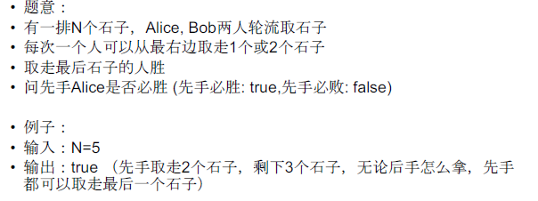
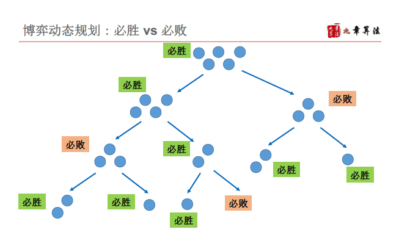
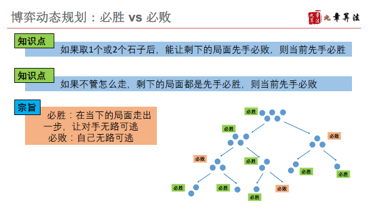
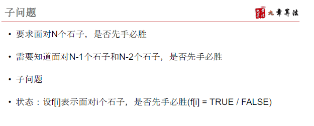
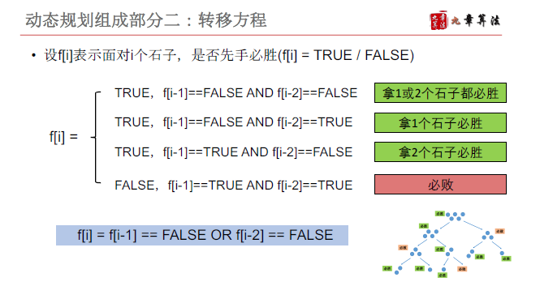
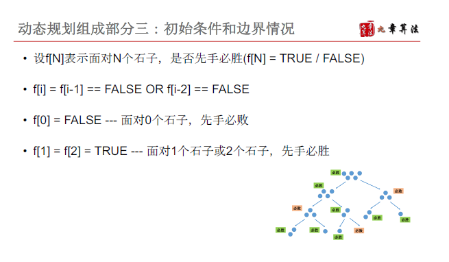

# 博弈型动态规划

## 基本性质和解题思路


例1 [LintCode 394 coins-in-a-line](https://www.lintcode.com/problem/coins-in-a-line/)
















```java
public class Solution {
    /**
     * @param n: An integer
     * @return: A boolean which equals to true if the first player will win
     */
    public boolean firstWillWin(int n) {
        // write your code here
        if(n == 0) {
            return false;
        }
        if(n == 1) {
            return true;
        }
        boolean[] f = new boolean[n+1];
        f[0] = false;
        f[1] = true;
        for(int i = 2; i <= n; i++) {
            // f[i-1] 必败 或者 f[i-2]必败
            f[i] = !f[i-1] || !f[i-2];
            
        }
        return f[n];
    }
}

```


https://www.lintcode.com/problem/coins-in-a-line-ii/description

```java
public class Solution {
    /**
     * @param values: a vector of integers
     * @return: a boolean which equals to true if the first player will win
     */
    public boolean firstWillWin(int[] values) {
        // write your code here
        int n = values.length;
        int l =0;
        int r = n-1;
        while(l<r) {
            int t = values[l];
            values[l] = values[r];
            values[r] = t;
            l++;
            r--;
        }
        if(n == 1) {
            return true;
        }
        if(n == 2) {
            return true;
        }
        int[] f = new int[n+1];
        f[0] = 0;
        f[1] = values[0];
        f[2] = values[0] + values[1];
        f[3] = values[1] + values[2];
        for( int i = 4; i <=n; i++) {
            f[i] = f[i-1] < f[i-2] ? values[i-1] + Math.min(f[i-2], f[i-3]) :
            values[i-1] + values[i-2] +  Math.min(f[i-3], f[i-4]);
        }
        return f[n] > f[n-1] || f[n] > f[n-2];
    }
}
```

