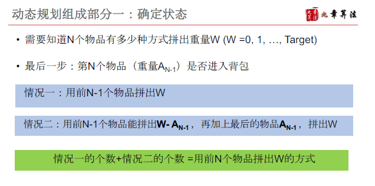
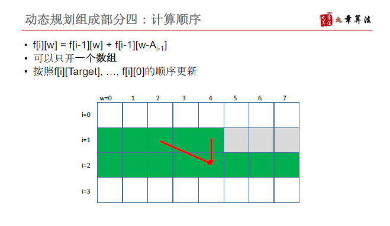

# 背包型动态规划

## 基本性质和解题思路


解题思路：

- 可行性背包
  - 题目要求最多装多少重量
  - 记录前i个物品能不能拼出重量w
- 计数型背包
  - 题目要求有多少种方式装出重量
  - Backpack V：记录前i个物品有多少种方式拼出重量W
  - Backpack VI: 记录有多少种方式拼出重量W
- 关键点
  - 最后一步-- 最后一个背包内的物品是哪个（只能用一次）/哪种（可以用无限次）
  - 背包的重量从0~target必定是状态


### 例1 [LintCode 92 Backpack](https://www.lintcode.com/problem/backpack/)

### 


```java
public class Solution {
    /**
     * @param m: An integer m denotes the size of a backpack
     * @param A: Given n items with size A[i]
     * @return: The maximum size
     */
    public int backPack(int m, int[] A) {
        // write your code here
        int n = A.length;
        boolean[][] f = new boolean[n+1][m+1]; // f[i][j] 前i个物品能不能装出重量j
        f[0][0] = true; 
        
        for(int i= 1; i <= n; i++) {
            f[i][0] = true;
            for(int j = 1; j <=m; j++) {
                f[i][j] = f[i-1][j];
                if(j - A[i-1] >= 0) {
                     f[i][j] =  f[i][j] || f[i-1][j-A[i-1]];
                }
                
            }
        }
        int res = 0;
        for(int j = m; j >=0; j--) {
            if(f[n][j]) {
                res = j;
                break;
            }
        }
        return res;
    }
}
```


### 例2 [LintCode 563 Backpack V](https://www.lintcode.com/problem/backpack-v/)








```java
public class Solution {
    /**
     * @param nums: an integer array and all positive numbers
     * @param target: An integer
     * @return: An integer
     */
    public int backPackV(int[] A, int target) {
        // write your code here
        int n = A.length;
        int[][] f = new int[n+1][target+1];
        
        f[0][0] = 1;
        // f[0][j] j > 0 0种 不能装出
        // f[i][0] i > 0 1种 
        for(int i = 1; i <= n; i++) {
            f[i][0] = 1;
            for(int j = 1; j <= target; j++) {
                f[i][j] = f[i-1][j];
                if(j - A[i-1] >= 0) {
                    f[i][j] += f[i-1][j-A[i-1]];
                }
            }
        }
        return f[n][target];
    }
}
```


### 例3 [LintCode 564 Backpack VI](https://www.lintcode.com/problem/combination-sum-iv)


```java
public class Solution {
    /**
     * @param nums: an integer array and all positive numbers, no duplicates
     * @param target: An integer
     * @return: An integer
     */
    public int backPackVI(int[] A, int n) {
        // write your code here
        int[] f = new int[n+1]; // f[i] 重量i有多少种方式
        f[0] = 1;
        for(int i = 1; i <= n; i++) {
            f[i] = 0;
            for(int j = 0; j < A.length; j++) {
                if(i - A[j] >=0) {
                    f[i] += f[i-A[j]];
                }
            }
        }
        return f[n];
    }
}
```


例4 [LintCode 125 Backpack II](https://www.lintcode.com/problem/backpack-ii)


```java
public class Solution {
    /**
     * @param m: An integer m denotes the size of a backpack
     * @param A: Given n items with size A[i]
     * @param V: Given n items with value V[i]
     * @return: The maximum value
     */
    public int backPackII(int m, int[] A, int[] V) {
        // write your code here
        int n = A.length;
        if(n == 0 || m == 0) {
            return 0;
        }
        
        int[][] f = new int[n+1][m+1];
        
        f[0][0] = 0;
        for(int i = 1; i <= m; i++) {
            f[0][i] = -1;
        }
        
        for(int i = 1; i <= n; i++) {
            f[i][0] = 0;
            for(int j = 1; j<=m;j++) {
                f[i][j] = f[i-1][j];
                if(j-A[i-1] >= 0 && f[i-1][j-A[i-1]] > -1) {
                    f[i][j] = Math.max(f[i][j], f[i-1][j-A[i-1]] + V[i-1]);
                }
            }
        }
        int res = 0;
        for(int i = 1; i <=m ;i++) {
            res = Math.max(res, f[n][i]);
        }
        return res;
    }
}
```


例5 [LintCode 440 Backpack III](http://www.lintcode.com/problem/backpack-iii/)


```
这道题的递推公式想的跟课上讲的不一样，但由于是加锁的题，无法验证思路，等有空在考虑考虑
定义f[i]是重量为i时候的最大价值
然后f[i] = max{f[i-1],  f[i - A[j]] +V[j]} 0<=j <= n-1 


```


