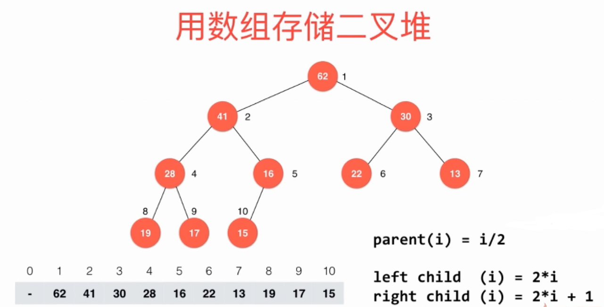
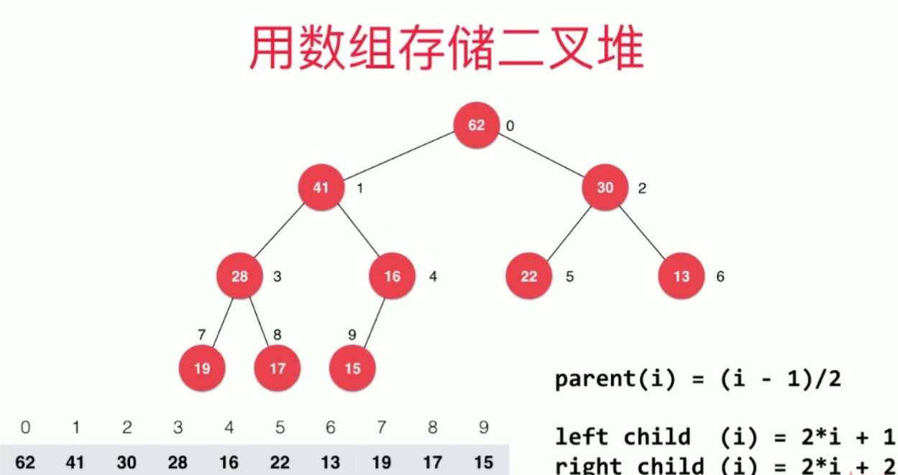
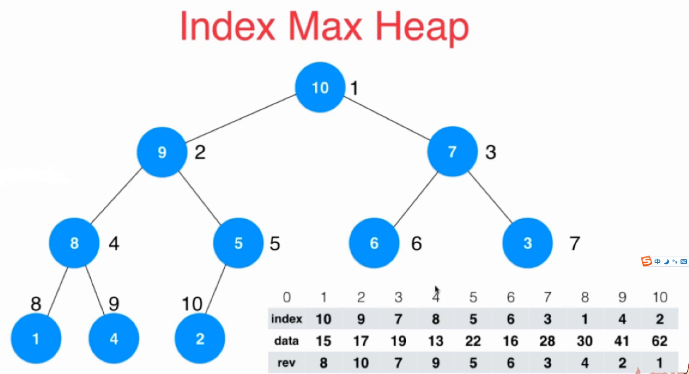

# 堆的基本实现

二叉堆是一颗完全二叉树，可以使用数组存储

## 1.孩子节点与父亲节点的序号关系

**序号从1开始时，左右孩子与父亲节点的关系：**



**序号从0开始时，左右孩子与父亲节点的关系**




## 2. 移除堆顶元素，后维持堆性质的操作--shift down

堆弹出堆顶元素的过程：

1. 将堆顶元素保存在临时变量
2. 交换data[0]和data[count-1]
3. count--
4. shiftDown(0)

```java
// 从最大堆中取出堆顶元素, 即堆中所存储的最大数据
public Item extractMax(){
    Item ret = data[0];
    swap( 0 , count-1 );
    count --;
    shiftDown(0);
    return ret;
}


```

shift down流程：

1. 若当前节点的左孩子存在，执行以下操作
2. 设左孩子为j节点，若右孩子存在，比较左右孩子大小，大的为新的j
3. 比较k节点和j节点，若k大于j停止循环，否则交换，k = j继续循环

```java
// shift down 大顶堆
private void shiftDown(int k){
    while(  2*k +1 < count ){ // 这个判断条件意思是k的左孩子的下标是存在的（记忆）
        int j = 2*k+1; 
        if( j+1 < count && data[j+1].compareTo(data[j]) > 0 ) 
            j ++;
        // data[j] 是 data[2*k+1]和data[2*k+2]中的最大值
        // 这里判断k与其左右孩子谁最大或最小的较好的写法是:
        // 先判断右孩子是否存在，再比较左右孩子，然后左右孩子大或小的那个再跟k比较 （记忆）
        if( data[k].compareTo(data[j]) >= 0 ) 
            break;
        swap(k, j);
        k = j;
    }
}
```


## 3. 建堆、向堆中添加新元素的操作---shift up

建堆过程：从最后一个节点的父节点开始，按照节点序号减小，依次调用shiftUp

```java
parent = (i - 1) / 2

i = count-1
```


添加新元素过程：

1. 将新元素放在数组最后一个元素的下一个位置
2. count++
3. shiftUp(count-1)


```java
// shiftUp 大顶堆
private void shiftUp(int k){
    while( k > 0 && data[(k-1)/2].compareTo(data[k]) < 0 ){ // k节点的parent = (k-1) / 2
        swap(k, (k-1)/2);
        k = (k-1)/2;
    }
}
```


## 4. 可优化的特殊操作

从堆中移除堆顶元素，需要调整堆shiftDown，时间复杂度0(log n)，添加一个元素需要放在数组最后一个元素之后，然后shiftUp，时间复杂度0(log n)，但是假如同时移除并添加一个元素（replace），可以合并这两个操作，直接返回堆顶元素，然后新元素替换堆顶元素，然后shiftDown


## 5. Java中PriorityQueue的使用


## 6. Leetcode例题

```java
/// 347. Top K Frequent Elements
/// https://leetcode.com/problems/top-k-frequent-elements/description/

import java.util.*;

public class Solution5 {

    public List<Integer> topKFrequent(int[] nums, int k) {

        TreeMap<Integer, Integer> map = new TreeMap<>();
        for(int num: nums){
            if(map.containsKey(num))
                map.put(num, map.get(num) + 1);
            else
                map.put(num, 1);
        }

        PriorityQueue<Integer> pq = new PriorityQueue<>(new Comparator<Integer>() {
            @Override
            public int compare(Integer a, Integer b) {
                return map.get(a) - map.get(b);
            }
        });
        for(int key: map.keySet()){
            if(pq.size() < k)
                pq.add(key);
            else if(map.get(key) > map.get(pq.peek())){
                pq.remove();
                pq.add(key);
            }
        }

        LinkedList<Integer> res = new LinkedList<>();
        while(!pq.isEmpty())
            res.add(pq.remove());
        return res;
    }
}
```


# 索引堆

如果需要动态修改堆中的元素，可以使用索引堆，关键点存储结构为以下3个：

1. 存储外界指定的索引-元素映射（或者key-元素映射）
2. 存储堆数据，但此时堆中的节点保存的是索引，决定节点大小的是索引对应的元素
3. 存储索引-该索引在堆中的下标



```java
import java.util.*;
import java.lang.*;

// 最大索引堆
public class IndexMaxHeap<Item extends Comparable> {

    protected Item[] data;      // 最大索引堆中的数据
    protected int[] indexes;    // 最大索引堆中的索引, indexes[x] = i 表示索引i在x的位置
    protected int[] reverse;    // 最大索引堆中的反向索引, reverse[i] = x 表示索引i在x的位置
    protected int count;
    protected int capacity;

    // 构造函数, 构造一个空堆, 可容纳capacity个元素
    public IndexMaxHeap(int capacity){
        data = (Item[])new Comparable[capacity+1];
        indexes = new int[capacity+1];
        reverse = new int[capacity+1];
        for( int i = 0 ; i <= capacity ; i ++ )
            reverse[i] = 0;

        count = 0;
        this.capacity = capacity;
    }

    // 返回索引堆中的元素个数
    public int size(){
        return count;
    }

    // 返回一个布尔值, 表示索引堆中是否为空
    public boolean isEmpty(){
        return count == 0;
    }

    // 向最大索引堆中插入一个新的元素, 新元素的索引为i, 元素为item
    // 传入的i对用户而言,是从0索引的
    public void insert(int i, Item item){

        assert count + 1 <= capacity;
        assert i + 1 >= 1 && i + 1 <= capacity;

        // 再插入一个新元素前,还需要保证索引i所在的位置是没有元素的。
        assert !contain(i);

        i += 1;
        data[i] = item;
        indexes[count+1] = i;
        reverse[i] = count + 1;
        count ++;

        shiftUp(count);
    }

    // 从最大索引堆中取出堆顶元素, 即索引堆中所存储的最大数据
    public Item extractMax(){
        assert count > 0;

        Item ret = data[indexes[1]];
        swapIndexes( 1 , count );
        reverse[indexes[count]] = 0;
        count --;
        shiftDown(1);

        return ret;
    }

    // 从最大索引堆中取出堆顶元素的索引
    public int extractMaxIndex(){
        assert count > 0;

        int ret = indexes[1] - 1;
        swapIndexes( 1 , count );
        reverse[indexes[count]] = 0;
        count --;
        shiftDown(1);

        return ret;
    }

    // 获取最大索引堆中的堆顶元素
    public Item getMax(){
        assert count > 0;
        return data[indexes[1]];
    }

    // 获取最大索引堆中的堆顶元素的索引
    public int getMaxIndex(){
        assert count > 0;
        return indexes[1]-1;
    }

    // 看索引i所在的位置是否存在元素
    boolean contain( int i ){
        assert  i + 1 >= 1 && i + 1 <= capacity;
        return reverse[i+1] != 0;
    }

    // 获取最大索引堆中索引为i的元素
    public Item getItem( int i ){
        assert contain(i);
        return data[i+1];
    }

    // 将最大索引堆中索引为i的元素修改为newItem
    public void change( int i , Item newItem ){

        assert contain(i);

        i += 1;
        data[i] = newItem;

        // 找到indexes[j] = i, j表示data[i]在堆中的位置
        // 之后shiftUp(j), 再shiftDown(j)
//        for( int j = 1 ; j <= count ; j ++ )
//            if( indexes[j] == i ){
//                shiftUp(j);
//                shiftDown(j);
//                return;
//            }

        // 有了 reverse 之后,
        // 我们可以非常简单的通过reverse直接定位索引i在indexes中的位置
        shiftUp( reverse[i] );
        shiftDown( reverse[i] );
    }

    // 交换索引堆中的索引i和j
    // 由于有了反向索引reverse数组，
    // indexes数组发生改变以后， 相应的就需要维护reverse数组
    private void swapIndexes(int i, int j){
        int t = indexes[i];
        indexes[i] = indexes[j];
        indexes[j] = t;

        reverse[indexes[i]] = i;
        reverse[indexes[j]] = j;
    }

    //********************
    //* 最大索引堆核心辅助函数
    //********************

    // 索引堆中, 数据之间的比较根据data的大小进行比较, 但实际操作的是索引
    private void shiftUp(int k){

        while( k > 1 && data[indexes[k/2]].compareTo(data[indexes[k]]) < 0 ){
            swapIndexes(k, k/2);
            k /= 2;
        }
    }

    // 索引堆中, 数据之间的比较根据data的大小进行比较, 但实际操作的是索引
    private void shiftDown(int k){

        while( 2*k <= count ){
            int j = 2*k;
            if( j+1 <= count && data[indexes[j+1]].compareTo(data[indexes[j]]) > 0 )
                j ++;

            if( data[indexes[k]].compareTo(data[indexes[j]]) >= 0 )
                break;

            swapIndexes(k, j);
            k = j;
        }
    }
}
```

