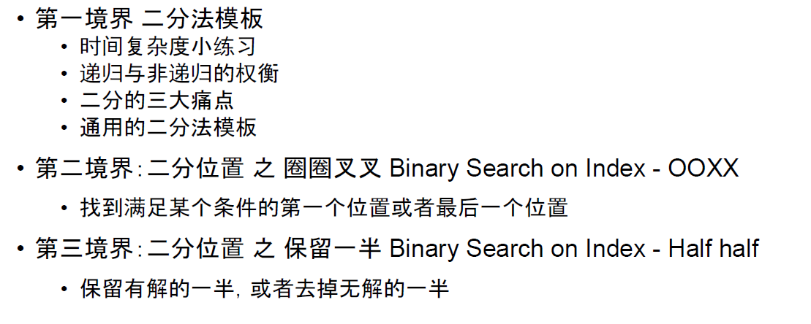

# 二分查找



## 1.基础模板

## 1.1 查找指定元素的position/first/last

```java

// 查找指定元素的位置
public int binarySearch(int[] arr, int l, int r, int target) {
    while(l <= r) {
        int mid = l + (r - l) / 2;
        int midVal = arr[mid];
        if(midVal < target) {
            l = mid + 1;
        }else if( midVal > target) {
            r = mid - 1;
        } else {
            return mid;
        }
    }
    return -1;
}

// 查找指定元素第一次出现的位置
public int binarySearchFirst(int[] arr, int l, int r, int target) {
    while(l <= r) {
        int mid = l + (r - l) / 2;
        int midVal = arr[mid];
        if(midVal < target) {
            l = mid + 1;
        }else if( midVal > target) {
            r = mid - 1;
        } else {
            if(mid == l || arr[mid-1] < midVal) {
                return mid;
            }
            // arr[mid-1] == midVal
            r = mid - 1;
        }
    }
    return -1;
}

// 查找指定元素最后一次出现的位置
public int binarySearchLast(int[] arr, int l, int r, int target) {
    while(l <= r) {
        int mid = l + (r - l) / 2;
        int midVal = arr[mid];
        if(midVal < target) {
            l = mid + 1;
        }else if( midVal > target) {
            r = mid - 1;
        } else {
            if(mid == r || arr[mid+1] > midVal) {
                return mid;
            }
            // arr[mid+1] == midVal
            l = mid +1;
        }
    }
    return -1;
}


```


# 1.2 查找指定元素的floor/ceil位置


```java
// 查找小于指定值的最大值的位置
public int binarySearchFloor(int[] arr, int l, int r, int target) {
    while(l <= r) {
        int mid = l + (r - l) / 2;
        int midVal = arr[mid];
        if(midVal < target){
            if(mid == r || arr[mid + 1] >= target) {
                return mid;
            }
           	// arr[mid+1] < target
            l = mid +1;
        } else { // midVal >= target
            r = mid -1;
        }
    }
    return -1;
}


// 查找大于指定值的最小值的位置
public int binarySearchCeil(int[] arr, int l, int r, int target) {
    while(l <= r) {
        int mid = l + (r - l) / 2;
        int midVal = arr[mid];
        if(midVal <= target) {
            l = mid +1;
        } else {
            if(mid == l || arr[mid-1] <= target) {
                return mid;
            }
            // arr[mid-1] > target
           r = mid - 1;
        }
    }
    return -1;
}

```


# 2. 习题

### 基础

基础模板
http://www.lintcode.com/problem/classical-binary-search/
http://www.lintcode.com/problem/first-position-of-target/
http://www.lintcode.com/problem/last-position-of-target/

模板基础上的应用
http://www.lintcode.com/problem/first-bad-version/
http://www.lintcode.com/problem/search-in-a-big-sorted-array/
http://www.lintcode.com/en/problem/total-occurrence-of-target/
http://www.lintcode.com/en/problem/search-for-a-range/

### 进阶

二维矩阵搜索问题
http://www.lintcode.com/en/problem/search-a-2d-matrix/
http://www.lintcode.com/en/problem/search-a-2d-matrix-ii/
http://www.lintcode.com/problem/smallest-rectangle-enclosing-black-pixels/


### 强化
查找最大值
http://www.lintcode.com/en/problem/maximum-number-in-mountain-sequence/

查找任意极大值
http://www.lintcode.com/problem/find-peak-element/

旋转数组查询
http://www.lintcode.com/problem/find-minimum-in-rotated-sorted-array/
http://www.lintcode.com/problem/search-in-rotated-sorted-array/

恢复旋转数组
三步翻转法：
• [**4,5**,1,2,3] → [5,4,**1,2,3**] → [**5,4,3,2,1**] → [1,2,3,4,5]
http://www.lintcode.com/problem/rotate-string/
http://www.lintcode.com/problem/recover-rotated-sorted-array/

https://www.lintcode.com/problem/divide-two-integers/description （3种情况会溢出，需要首先处理）

平方根
https://www.lintcode.com/problem/sqrtx/description 

https://www.lintcode.com/problem/sqrtx-ii/description

https://www.lintcode.com/problem/find-the-duplicate-number/description

二分条件比较难想（这题还有当成指针的O(n)）
https://www.lintcode.com/problem/find-the-duplicate-number/description

可以考虑把需要解答的问题二分，从而排除掉一部分范围（既要考虑下标，又要考虑是第几个，一定要分清什么表示什么，关系是什么，否则就是改不完的bug）
https://leetcode-cn.com/problems/median-of-two-sorted-arrays/

### 扩展

两道比较特殊的二分题目，假如求的是符合某个条件的值，那么可以直接对这个值的值域二分
https://www.lintcode.com/problem/wood-cut/description
https://www.lintcode.com/problem/copy-books/description 这个也可以用dp
题目等价于：有n根绳子按一定顺序排列，长度各异。一根合格的绳子的长度至少为m，现在希望你连接某些相邻的绳子，从而尽可能获得最多的合格的绳子，问最多可以获得多少合格的绳子

这也可以二分？
https://www.lintcode.com/problem/maximum-average-subarray/description
https://www.lintcode.com/problem/maximum-average-subarray-ii/description