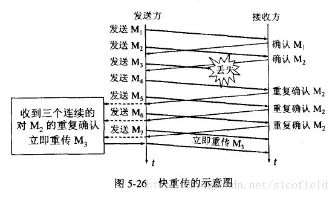
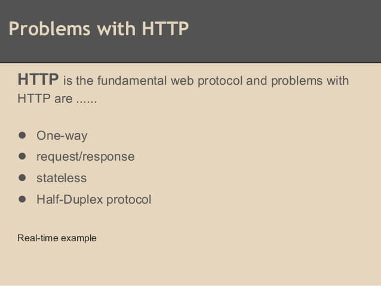

[TOC]


# 1. OSI网络模型各层协议


# 2. 数据链路层

## 2.1 mac协议


 （ 前同步码     帧开始定界符） （**目的地址         源地址        ip协议类型        数据        校验码）**

**目的地址，源地址**   6字节（48bit）MAC地址

**ip协议类型，**ipv4(0x0800),ipv6()

**数据**，最小值46是由于CSMA/CD算法中以太网最短帧为64字节（发送数据同时检测是否冲突，所以需要保证一定的最短帧长），最大值1500只是规定（**即以太网MTU最大传输单元为1500**）

所以MAC帧长度为64~1518（不考虑校验码，60~1514），假如

CSMA/CD 载波侦听多路访问/碰撞检测 应用于有线连接的局域网

CSMA/CA 载波侦听多路访问/碰撞避免 应用于无线局域网

使用冲突避免的原因，（1）无线介质信号强度动态变化范围大，硬件花费过大；（2）不是所有的站点都能听到对方

冲突避免的方法，（1）预约信道，发送方在发送数据同时通知其他站点自己传输数据需要的时间，使其他站点暂时不发送数据

（2）ACK帧，站点在正确收到发给自己的数据帧（除广播帧和组播帧外），都需要向对方发送一个ACK帧，规定时间内未收到该帧，发送方则认为发送失败，进行重发（直到重发次数上限）

（3）RTS/CTS帧，可选策略，用于解决隐蔽站

冲突避免算法增加了的网络流量，性能比冲突检测差

**实际的捕捉到的MAC协议**


## 2.2 自动重传请求（Automatic Repeat-reQuest，ARQ）

[自动重传请求](https://baike.baidu.com/item/自动重传请求)分成为三种:

- 停等式(stop-and-wait）ARQ
- 回退n帧（go-back-n）ARQ
- 选择性重传（selective repeat）ARQ

**回退n帧**和**选择性重传**是[滑动窗口](https://baike.baidu.com/item/滑动窗口)技术与请求重发技术的结合，由于窗口尺寸开到足够大时，帧在线路上可以连续地流动，因此又称其为[连续ARQ协议](https://baike.baidu.com/item/连续ARQ协议)（**TCP是基于连续ARQ协议的数据链路层发送的**）。

### 2.2.1 停等式ARQ

在停等式ARQ中，数据[报文](https://baike.baidu.com/item/报文)发送完成之后，发送方等待接收方的状态报告，如果状态报告报文发送成功，发送后续的数据报文，否则重传该报文。

停等式ARQ，[发送窗口](https://baike.baidu.com/item/发送窗口)和接收窗口大小均为1，发送方每发送一帧之后就必须停下来等待接收方的确认返回，仅当接收方确认正确接收后再继续发送下一帧。该方法所需要的缓冲存储空间最小，缺点是信道效率很低。

### 2.2.2 回退n帧的ARQ

发信侧不用等待收信侧的应答，持续的发送多个帧，假如发现已发送的帧中有错误发生，那么从那个发生错误的帧开始及其之后所有的帧全部再重新发送。

特点：（GBN）复杂度低，但是不必要的帧会再重发，所以大幅度范围内使用的话效率是不高的

例：如果序列号有K bits，那么这个ARQ的协议大小为：2^k-1。

### 2.2.3 选择性重传ARQ

发信侧不用等待收信侧的应答，持续的发送多个帧，假如发现已发送的帧中有错误发生，那么发信侧将只重新发送那个发生错误的帧。

特点：相对于GBN 复杂度高，但是不需要发送没必要的帧，所以效率高。

例：如果序列号有K bits，那么这个ARQ的协议大小为：2^(k-1)。

### 2.2.4 混合ARQ

在混合ARQ中，数据报文传送到接收方之后，即使出错也不会被丢弃。接收方指示发送方重传出错[报文](https://baike.baidu.com/item/报文)的部分或者全部信息，将再次收到的报文信息与上次收到的报文信息进行合并，以恢复报文信息。


# 3. 网络层

## 3.1 IPv4协议


**版本**，4

**首部长度**，ip首部的长度，单位是4字节（图上的一行），默认值0101（即5*4=20字节，可变部分为0）

**总长度**，ip首部+数据的总长度，单位1字节，最大65535（2^16-1）

**标识**，每产生一个数据报该值就+1，对于一个超过MTU长度的数据报，分片时，每个数据报的该字段是都是相同的

**标志，3bit，保留位，不允许分片，更多分片**

**片偏移，13bit，在原数据报中的位置，单位8字节**

**首部校验和，仅校验首部**

**生存时间TTL，在网络中可经过的路由器数的最大值，每经过一个路由器TTL会减一，为0时，该数据报会被丢弃**

**协议，指出携带的协议，TCP 6  UDP 17**

**源地址字段，发送方ip**

**目的地址字段，接收方ip**

**实际捕捉的ip协议**


## 3.2 IP地址的分类

（1）网络地址

  IP地址由网络号（包括子网号）和主机号组成，网络地址的主机号为全0，网络地址代表着整个网络。

（2）广播地址

   广播地址通常称为直接广播地址，是为了区分受限广播地址。

   广播地址与网络地址的主机号正好相反，广播地址中，主机号为全1。当向某个网络的广播地址发送消息时，该网络内的所有主机都能收到该广播消息。

（3）组播地址

  D类地址就是组播地址。

   先回忆下A，B，C，D类地址吧

  A类地址以00开头，第一个字节作为网络号，地址范围为：0.0.0.0~127.255.255.255；

  B类地址以10开头，前两个字节作为网络号，地址范围是：128.0.0.0~191.255.255.255;

  C类地址以110开头，前三个字节作为网络号，地址范围是：192.0.0.0~223.255.255.255。

  D类地址以1110开头，地址范围是224.0.0.0~239.255.255.255，D类地址作为组播地址（一对多的通信）；

  E类地址以1111开头，地址范围是240.0.0.0~255.255.255.255，E类地址为保留地址，供以后使用。

  Notice：只有A,B,C有网络号和主机号之分，D类地址和E类地址没有划分网络号和主机号。

 （4）255.255.255.255

   该IP地址指的是受限的广播地址。受限广播地址与一般广播地址（直接广播地址）的区别在于，受限广播地址之只能用于本地网络，路由器不会转发以受限广播地址为目的地址的分组；一般广播地址既可在本地广播，也可跨网段广播。例如：主机192.168.1.1/30上的直接广播数据包后，另外一个网段192.168.1.5/30也能收到该数据报；若发送受限广播数据报，则不能收到。

  Notice：一般的广播地址（直接广播地址）能够通过某些路由器（当然不是所有的路由器），而受限的广播地址不能通过路由器。

  （5）0.0.0.0

​    常用于寻找自己的IP地址，例如在我们的RARP，BOOTP和DHCP协议中，若某个未知IP地址的无盘机想要知道自己的IP地址，它就以255.255.255.255为目的地址，向本地范围（具体而言是被各个路由器屏蔽的范围内）的服务器发送IP请求分组。

 （6）回环地址

  127.0.0.0/8被用作回环地址，回环地址表示本机的地址，常用于对本机的测试，用的最多的是127.0.0.1。

 （7）A、B、C类私有地址（ABC类都有一部分是私有地址，其余的可以做公网地址）

  私有地址(private address)也叫专用地址，它们不会在全球使用，只具有本地意义。

  A类私有地址：10.0.0.0/8，范围是：10.0.0.0~10.255.255.255

  B类私有地址：172.16.0.0/12，范围是：172.16.0.0~172.31.255.255

  C类私有地址：192.168.0.0/16，范围是：192.168.0.0~192.168.255.255


## 3.3 子网掩码的作用

子网掩码只有一个作用，就是将某个IP地址划分成[网络地址](http://www.netfoucs.com/article/u012422829/104939.html)和[主机地址](http://www.netfoucs.com/article/u012422829/104939.html)两部分。

用于子网掩码的位数决定于可能的子网数目和每个子网的主机数目。

**计算方法示例：**

定义子网掩码的步骤为：

A、确定哪些组地址归我们使用。比如我们申请到的网络号为 “210.73.a.b”，该网络地址为c类IP地址，网络标识为“210.73.a”，主机标识为“b”。

B、根据我们所需的子网数以及将来可能扩充到的子网数，用宿主机的一些位来定义子网掩码。比如我们需要12个子网，将来可能需要16个。用第四个字节的前四位确定子网掩码。前四位都置为“1”，即第四个字节为“11110000”，这个数我们暂且称作新的二进制子网掩码。

C、把对应初始网络的各个位都置为“1”，即前三个字节都置为“1”，则子网掩码的间断二进制形式为：“11111111.11111111.11111111.11110000” 。

D、把这个数转化为间断十进制形式为：“255.255.255.240” 。


# 4. 传输层

## 4.1 TCP


### 4.1.1 TCP建立连接


### 4.1.2 TCP断开连接


一些常见问题：

【问题1】为什么连接的时候是三次握手，关闭的时候却是四次握手？

答：因为当Server端收到Client端的SYN连接请求报文后，可以直接发送SYN+ACK报文。其中ACK报文是用来应答的，SYN报文是用来同步的。但是关闭连接时，当Server端收到FIN报文时，很可能并不会立即关闭SOCKET，所以只能先回复一个ACK报文，告诉Client端，"你发的FIN报文我收到了"。只有等到我Server端所有的报文都发送完了，我才能发送FIN报文，因此不能一起发送。故需要四步握手。

【问题2】为什么TIME_WAIT状态需要经过2MSL(最大报文段生存时间)才能返回到CLOSE状态？

答：虽然按道理，四个报文都发送完毕，我们可以直接进入CLOSE状态了，但是我们必须假象网络是不可靠的，有可以最后一个ACK丢失。所以TIME_WAIT状态就是用来重发可能丢失的ACK报文。在Client发送出最后的ACK回复，但该ACK可能丢失。Server如果没有收到ACK，将不断重复发送FIN片段。所以Client不能立即关闭，它必须确认Server接收到了该ACK。Client会在发送出ACK之后进入到TIME_WAIT状态。Client会设置一个计时器，等待2MSL的时间。如果在该时间内再次收到FIN，那么Client会重发ACK并再次等待2MSL。所谓的2MSL是两倍的MSL(Maximum Segment Lifetime)。MSL指一个片段在网络中最大的存活时间，2MSL就是一个发送和一个回复所需的最大时间。如果直到2MSL，Client都没有再次收到FIN，那么Client推断ACK已经被成功接收，则结束TCP连接。

【问题3】为什么不能用两次握手进行连接？

答：3次握手完成两个重要的功能，既要双方做好发送数据的准备工作(双方都知道彼此已准备好)，也要允许双方就初始序列号进行协商，这个序列号在握手过程中被发送和确认。

       现在把三次握手改成仅需要两次握手，死锁是可能发生的。作为例子，考虑计算机S和C之间的通信，假定C给S发送一个连接请求分组，S收到了这个分组，并发 送了确认应答分组。按照两次握手的协定，S认为连接已经成功地建立了，可以开始发送数据分组。可是，C在S的应答分组在传输中被丢失的情况下，将不知道S 是否已准备好，不知道S建立什么样的序列号，C甚至怀疑S是否收到自己的连接请求分组。在这种情况下，C认为连接还未建立成功，将忽略S发来的任何数据分 组，只等待连接确认应答分组。而S在发出的分组超时后，重复发送同样的分组。这样就形成了死锁。

【问题4】如果已经建立了连接，但是客户端突然出现故障了怎么办？

TCP还设有一个保活计时器，显然，客户端如果出现故障，服务器不能一直等下去，白白浪费资源。服务器每收到一次客户端的请求后都会重新复位这个计时器，时间通常是设置为2小时，若两小时还没有收到客户端的任何数据，服务器就会发送一个探测报文段，以后每隔75秒钟发送一次。若一连发送10个探测报文仍然没反应，服务器就认为客户端出了故障，接着就关闭连接。


### 4.1.3 如何理解TCP是可靠传输的

- 可以明确知道通信成功
- 或者明确知道通信失败


### 4.1.4 TCP如何保证可靠传输

- 数据包校验：目的是检测数据在传输过程中的任何变化，若校验出包有错，则丢弃报文段并且不给出响应，这时TCP发送数据端超时后会重发数据；
- 对失序数据包重排序：既然TCP报文段作为IP数据报来传输，而IP数据报的到达可能会失序，因此TCP报文段的到达也可能会失序。TCP将对失序数据进行重新排序，然后才交给应用层；
- 丢弃重复数据：对于重复数据，能够丢弃重复数据；
- 应答机制：当TCP收到发自TCP连接另一端的数据，它将发送一个确认。这个确认不是立即发送，通常将推迟几分之一秒；
- 超时重发：当TCP发出一个段后，它启动一个定时器，等待目的端确认收到这个报文段。如果不能及时收到一个确认，将重发这个报文段；
- 流量控制：TCP连接的每一方都有固定大小的缓冲空间。TCP的接收端只允许另一端发送接收端缓冲区所能接纳的数据，这可以防止较快主机致使较慢主机的缓冲区溢出，这就是流量控制。TCP使用的流量控制协议是可变大小的滑动窗口协议。


### 4.1.5 TCP流量控制（确定可以有多少已发送但没ACK的）

流量控制
流量控制协议通过滑动窗口来实现.

简单来说就是**发送窗口的大小** = min(接收方ACK提供的窗口大小, 发送方的拥塞窗口大小)


### 4.1.6 TCP拥塞控制机制（确定发送速率）

计算机网络中的带宽、交换结点中的缓存及处理机等都是网络的资源。在某段时间，若对网络中某一资源的需求超过了该资源所能提供的可用部分，网络的性能就会变坏，这种情况就叫做拥塞。拥塞控制就是 防止过多的数据注入网络中，这样可以使网络中的路由器或链路不致过载。拥塞控制的方法主要有以下四种：

- 慢启动

  不要一开始就发送大量的数据，先探测一下网络的拥塞程度，也就是说由小到大逐渐增加拥塞窗口的大小;

- 拥塞避免

  拥塞避免算法让拥塞窗口缓慢增长，即每经过一个往返时间RTT就把发送方的拥塞窗口cwnd加1，而不是加倍，这样拥塞窗口按线性规律缓慢增长。

  

- 快重传

  快重传要求接收方在收到一个 **失序的报文段** 后就立即发出 **重复确认**（为的是使发送方及早知道有报文段没有到达对方）而不要等到自己发送数据时捎带确认。快重传算法规定，发送方只要一连收到三个重复确认就应当立即重传对方尚未收到的报文段，而不必继续等待设置的重传计时器时间到期。

  

- 快恢复

  快重传配合使用的还有快恢复算法，当发送方连续收到三个重复确认时，就执行“乘法减小”算法，把ssthresh门限减半，但是接下去并不执行慢开始算法：因为如果网络出现拥塞的话就不会收到好几个重复的确认，所以发送方现在认为网络可能没有出现拥塞。所以此时不执行慢开始算法，而是将cwnd设置为ssthresh的大小，然后执行拥塞避免算法。

  


### 4.1.7 TCP长连接和短连接

短连接指通常用一次就断开的tcp连接，每次都要反复3次握手、4次挥手

长连接指长时间反复使用同一个tcp连接，服务端需要消耗资源维护这个连接


## 4.2 UDP


不可靠，发出去不知道通信是成功还是失败

面向数据报

没有拥塞控制

但是效率高，因为不基于应答机制，也不用握手

## 4.3 TCP和UDP对比

TCP (Transmission Control Protocol)和UDP(User Datagram Protocol)协议属于传输层协议，它们之间的区别包括：

- TCP是面向连接的，UDP是无连接的；
- TCP是可靠的，UDP是不可靠的；
- TCP只支持点对点通信，UDP支持一对一、一对多、多对一、多对多的通信模式；
- TCP是面向字节流的，UDP是面向报文的；
- TCP有拥塞控制机制;UDP没有拥塞控制，适合媒体通信；
- TCP首部开销(20个字节)比UDP的首部开销(8个字节)要大；

# 5. 应用层

## 5.1 http

### 5.1.1 GET和POST区别

1、区别

GET在浏览器回退时是无害的，POST会重新提交请求

GET会被浏览器主动缓存，POST不会（除非特意设置）

GET请求的参数只能进行urlencoded编码，而POST在body中支持多种编码方式(urlencoded，form-data)

GET请求在浏览器中有长度限制（对于GET请求总长度有限制），POST没有

GET请求参数在url中，POST在body中，相对来说POST更安全

实际上HTTP协议规范并没有限制GET和POST的长度

实际上是浏览器对GET长度有限制，不同的浏览器限制长度不同，超过长度浏览器不允许发送

另外POST请求也长度也不是完全没有限制，服务端web容器可以通过配置限制Post长度，超过时会出错

GET请求只有1步，直接发送全部报文（但是GET只有header）

POST请求分2步，先发header，再发body

但该结论的如何理解应该深思。

2、实际报文

**当携带的参数比较短的时候，即一帧能够携带全部HTTP报文（每帧最长1514，MAC头+IP头+TCP头+HTTP请求信息，如果算MAC校验位4位，则是1518）**

Safari_5.34.57.2.1417745549浏览器中


第一个框是POST请求，可以看到POST第一个HTTP请求帧长677个字节


从该请求HTTP协议部分可以看到没有携带数据

POST第二个HTTP请求帧长870个字节


数据对应的值


可以看到HTTP协议部分只有数据，是接着上一个请求发送

由此说明，在Safari中POST请求是先发送Header，再发送Body


GET请求因为长度只有531字节，另外也没有Body，所以肯定是一次请求，这里并不能说明问题。

**当报文数据足够长的的时候，即一个TCP报文不能包含全部数据（每帧最长1514，MAC头+IP头+TCP头+HTTP请求信息，如果算MAC校验位4位，则是1518）**

**提交了一个表单，其中包含图片，于是看到了下面的情况**


**即先发送Header，后发送Body数据，由于Body太大所以需要多次发送**


本次GET请求时带了参数testParam="a…a"共1500个a，使一次请求无法发送全部数据，致使GET也不再是一次请求，但这里和POST有一个关键的区别，**GET的第一个请求是达到了最大帧长度的**，只是因为header太长（url在header中）才分成了两个。

3、真 · 结论

在部分浏览器中，HTTP协议的POST请求分为两步，（1）发送header （2）发送body 

GET请求，因为没有body，只有（1）发送header

当header长度超过1460时，会产生两个或以上个TCP包，与请求类型无关

当body长度超过1460时，会产生两个或以上个TCP包

POST请求在header长度小于1460（即该帧没有达到最大长度，仍然可以携带数据）时，还是把body中的数据另外放在一个TCP包中，即POST请求会专门将header和body分开发送

分开发送的好处是：假如Post的header出现错误（参数错误或被服务器拒绝），就可以停止发送body的数据，从而使网络上减少必要的数据传输

注意不是全部浏览器都是这样，最新的chrome已经不是这样了，只测了Safari_5.34.57.2.1417745549是这样

一些长度

MAC头 6 + 6 + 2= 14字节   

IP头 20字节

TCP头 20字节

HTTP数据 至多1460字节

校验码 4 字节

传输的一帧

MAC头  { IP头  TCP头  HTTP数据  }   校验码      { }中长度46~1500

HTTP数据每帧至多1460

一帧最长 14 + 1500 = 1514  （算校验码 1518）


### 5.1.2 HTTP 1.0 1.1 2.0 3.0

HTTP1.x有以下几个主要缺点：

1. HTTP/1.0一次只允许在一个TCP连接上发起一个请求，HTTP/1.1使用的流水线技术也只能部分处理请求并发，仍然会存在队列头阻塞问题，因此客户端在需要发起多次请求时，通常会采用建立多连接来减少延迟。
2. 单向请求，只能由客户端发起。
3. 请求报文与响应报文首部信息冗余量大。
4. 数据未压缩，导致数据的传输量大。


HTTP2.0

HTTP2.0中所有加强性能的核心是二进制传输，在HTTP1.x中，我们是通过文本的方式传输数据。基于文本的方式传输数据存在很多缺陷，文本的表现形式有多样性，因此要做到健壮性考虑的场景必然有很多，但是二进制则不同，只有0和1的组合，因此选择了二进制传输，实现方便且健壮。
在HTTP2.0中引入了新的编码机制，所有传输的数据都会被分割，并采用二进制格式编码。

为了保证HTTP不受影响，那就需要在应用层（HTTP2.0）和传输层（TCP or UDP）之间增加一个二进制分帧层。在二进制分帧层上，HTTP2.0会将所有传输的信息分为更小的消息和帧，并采用二进制格式编码，其中HTTP1.x的首部信息会被封装到Headers帧，而Request Body则封装到Data帧。

**多路复用**

在HTTP1.0中，我们经常会使用到雪碧图、使用多个域名等方式来进行优化，都是因为浏览器限制了同一个域名下的请求数量，当页面需要请求很多资源的时候，队头阻塞（Head of line blocking）会导致在达到最大请求时，资源需要等待其他资源请求完成后才能继续发送。
HTTP2.0中，有两个概念非常重要：帧（frame）和流（stream）。
帧是最小的数据单位，每个帧会标识出该帧属于哪个流，流是多个帧组成的数据流。
所谓多路复用，即在一个TCP连接中存在多个流，即可以同时发送多个请求，对端可以通过帧中的表示知道该帧属于哪个请求。在客户端，这些帧乱序发送，到对端后再根据每个帧首部的流标识符重新组装。通过该技术，可以避免HTTP旧版本的队头阻塞问题，极大提高传输性能。


**Header压缩**

在HTTP1.0中，我们使用文本的形式传输header，在header中携带cookie的话，每次都需要重复传输几百到几千的字节，这着实是一笔不小的开销。
在HTTP2.0中，我们使用了HPACK（HTTP2头部压缩算法）压缩格式对传输的header进行编码，减少了header的大小。并在两端维护了索引表，用于记录出现过的header，后面在传输过程中就可以传输已经记录过的header的键名，对端收到数据后就可以通过键名找到对应的值。

**服务器Push**

在HTTP2.0中，服务端可以在客户端某个请求后，主动推送其他资源。
可以想象一下，某些资源客户端是一定会请求的，这时就可以采取服务端push的技术，提前给客户端推送必要的资源，就可以相对减少一点延迟时间。在浏览器兼容的情况下也可以使用prefetch。

**更安全**

HTTP2.0使用了tls的拓展ALPN做为协议升级，除此之外，HTTP2.0对tls的安全性做了近一步加强，通过黑名单机制禁用了几百种不再安全的加密算法。

[http1.1和2.0速度对比](https://http2.akamai.com/demo)

HTTP3.0 --- QUIC（Quick UDP Internet Connection）

Google的新一代协议，不再基于TCP，而是基于UDP。


### 5.1.3 HTTP状态码

1xx:信息响应类，表示接收到请求并且继续处理 

2xx:处理成功响应类，表示动作被成功接收、理解和接受 

3xx:重定向响应类，为了完成指定的动作，必须接受进一步处理 

4xx:客户端错误，客户请求包含语法错误或者是不能正确执行 

5xx:服务端错误，服务器不能正确执行一个正确的请求 


下表列出了所有HTTP状态码,以及他们各自所代表的含义:

[参考：HTTP状态码](https://tool.lu/httpcode/)

| 状态码       | 原因短语                                           | 代表含义                                                     | HTTP 版本           |
| :----------- | :------------------------------------------------- | :----------------------------------------------------------- | :------------------ |
| 消息响应     |                                                    |                                                              |                     |
| 100          | Continue (继续)                                    | 客户端应当继续发送请求.这个临时响应是用来通知客户端它的部分请求已经被服务器接收,且仍未被拒绝.客户端应当继续发送请求的剩余部分,或者如果请求已经完成,忽略这个响应.服务器必须在请求完成后向客户端发送一个最终响应. | HTTP/1.1 可用       |
| 101          | Switching Protocol (切换协议)                      | 服务器已经理解了客户端的请求，并将通过Upgrade消息头通知客户端采用不同的协议来完成这个请求。在发送完这个响应最后的空行后，服务器将会切换到 在Upgrade消息头中定义的那些协议。: 只有在切换新的协议更有好处的时候才应该采取类似措施。例如，切换到新的HTTP版本比旧版本更有优势，或者切换到一个实时且同步的协议以传送利用此类特 性的资源。 | HTTP/1.1 可用       |
| 成功响应     |                                                    |                                                              |                     |
| 200          | OK (成功)                                          | 请求成功.成功的意义根据请求所使用的方法不同而不同.GET: 资源已被提取,并作为响应体传回客户端.HEAD: 实体头已作为响应头传回客户端POST: 经过服务器处理客户端传来的数据,适合的资源作为响应体传回客户端.TRACE: 服务器收到请求消息作为响应体传回客户端. | HTTP/0.9 可用       |
| 201          | Created (已创建)                                   | 请求成功，而且有一个新的资源已经依据请求的需要而建立，通常这是 PUT 方法得到的响应码. | HTTP/0.9 可用       |
| 202          | Accepted (已创建)                                  | 服务器已接受请求，但尚未处理。正如它可能被拒绝一样，最终该请求可能会也可能不会被执行。在异步操作的场合下，没有比发送这个状态码更方便的做法了。:返回202状态码的响应的目的是允许服务器接受其他过程的请求（例如某个每天只执行一次的基于批处理的操作），而不必让客户端一直保持与服务器的连接直到批处理操作全部完成。在接受请求处理并返回202状态码的响应应当在返回的实体中包含一些指示处理当前状态的信息，以及指向处理状态监视器或状态预测的指针，以便用户能够估计操作是否已经完成。 | HTTP/0.9 可用       |
| 203          | Non-Authoritative Information (未授权信息)         | 服务器已成功处理了请求,但返回的实体头部元信息不是在原始服务器上有效的确定集合，而是来自本地或者第三方的拷贝,如果不是上述情况,使用200状态码才是最合适的. | HTTP/0.9 and 1.1    |
| 204          | No Content (无内容)                                | 该响应没有响应内容,只有响应头,响应头也可能是有用的.用户代理可以根据新的响应头来更新对应资源的缓存信息. | HTTP/0.9 可用       |
| 205          | Reset Content (重置内容)                           | 告诉用户代理去重置发送该请求的窗口的文档视图.                | HTTP/1.1 可用       |
| 206          | Partial Content (部分内容)                         | 当客户端通过使用range头字段进行文件分段下载时使用该状态码    | HTTP/1.1 可用       |
| 重定向       |                                                    |                                                              |                     |
| 300          | Multiple Choice (多种选择)                         | 该请求有多种可能的响应,用户代理或者用户必须选择它们其中的一个.服务器没有任何标准可以遵循去代替用户来进行选择. | HTTP/1.0 and later  |
| 301          | Moved Permanently (永久移动)                       | 该状态码表示所请求的URI资源路径已经改变,新的URL会在响应的`Location`:头字段里找到. | HTTP/0.9 可用       |
| 302          | Found (临时移动)                                   | 该状态码表示所请求的URI资源路径临时改变,并且还可能继续改变.因此客户端在以后访问时还得继续使用该URI.新的URL会在响应的`Location:`头字段里找到. | HTTP/0.9 可用       |
| 303          | See Other (查看其他位置)                           | 服务器发送该响应用来引导客户端使用GET方法访问另外一个URI.    | HTTP/0.9 and 1.1    |
| 304          | Not Modified (未修改)                              | 告诉客户端,所请求的内容距离上次访问并没有变化. 客户端可以直接从浏览器缓存里获取该资源. | HTTP/0.9 可用       |
| 305          | Use Proxy (使用代理)                               | 所请求的资源必须统过代理才能访问到.由于安全原因,该状态码并未受到广泛支持. | HTTP/1.1 可用       |
| 306          | *unused* (未使用)                                  | 这个状态码已经不再被使用,当初它被用在HTTP 1.1规范的旧版本中. | HTTP/1.1 可用       |
| 307          | Temporary Redirect (临时重定向)                    | 服务器发送该响应用来引导客户端使用相同的方法访问另外一个URI来获取想要获取的资源.新的URL会在响应的`Location:`头字段里找到.与302状态码有相同的语义,且前后两次访问必须使用相同的方法(GET POST). | HTTP/1.1 可用       |
| 308          | Permanent Redirect (永久重定向)                    | 所请求的资源将永久的位于另外一个URI上.新的URL会在响应的`Location:`头字段里找到.与301状态码有相同的语义,且前后两次访问必须使用相同的方法(GET POST). | HTTPbis  (试验草案) |
| 客户端错误   |                                                    |                                                              |                     |
| 400          | Bad Request (错误请求)                             | 因发送的请求语法错误,服务器无法正常读取.                     | HTTP/0.9 可用       |
| 401          | Unauthorized (未授权)                              | 需要身份验证后才能获取所请求的内容,类似于403错误.不同点是.401错误后,只要正确输入帐号密码,验证即可通过. | HTTP/0.9 可用       |
| 402          | Payment Required (需要付款)                        | 该状态码被保留以供将来使用.创建此代码最初的目的是为数字支付系统而用,然而,到现在也没投入使用. | HTTP/0.9 and 1.1    |
| 403          | Forbidden (禁止访问)                               | 客户端没有权利访问所请求内容,服务器拒绝本次请求.             | HTTP/0.9 可用       |
| 404          | Not Found (未找到)                                 | 服务器找不到所请求的资源.由于经常发生此种情况,所以该状态码在上网时是非常常见的. | HTTP/0.9 可用       |
| 405          | Method Not Allowed (不允许使用该方法)              | 该请求使用的方法被服务器端禁止使用,RFC2616中规定, `GET` 和 `HEAD` 方法不能被禁止. | HTTP/1.1 可用       |
| 406          | Not Acceptable (无法接受)                          | 在进行服务器驱动内容协商后,没有发现合适的内容传回给客户端.   | HTTP/1.1 可用       |
| 407          | Proxy Authentication Required (要求代理身份验证)   | 类似于状态码 401,不过需要通过代理才能进行验证.               | HTTP/1.1 可用       |
| 408          | Request Timeout (请求超时)                         | 客户端没有在服务器预备等待的时间内完成一个请求的发送.这意味着服务器将会切断和客户端的连接. 在其他浏览器中,这种响应更常见一些, 例如Chrome 和 IE9, 目的是为了使用HTTP 预连机制加快浏览速度. 同时注意,一些服务器不发送此种响应就直接切断连接. | HTTP/1.1 可用       |
| 409          | Conflict (冲突)                                    | 该请求与服务器的当前状态所冲突.                              | HTTP/1.1 可用       |
| 410          | Gone (已失效)                                      | 所请求的资源已经被删除.                                      | HTTP/1.1 可用       |
| 411          | Length Required (需要内容长度头)                   | 因服务器在本次请求中需要 `Content-Length` 头字段,而客户端没有发送.所以,服务器拒绝了该请求. | HTTP/1.1 可用       |
| 412          | Precondition Failed (预处理失败)                   | 服务器没能满足客户端在获取资源时在请求头字段中设置的先决条件. | HTTP/1.1 可用       |
| 413          | Request Entity Too Large (请求实体过长)            | 请求实体大小超过服务器的设置的最大限制,服务器可能会关闭HTTP链接并返回`Retry-After` 头字段. | HTTP/1.1 可用       |
| 414          | Request-URI Too Long (请求网址过长)                | 客户端请求所包含的URI地址太长,以至于服务器无法处理.          | HTTP/1.1 可用       |
| 415          | Unsupported Media Type (媒体类型不支持)            | 服务器不支持客户端所请求的媒体类型,因此拒绝该请求.           | HTTP/1.1 可用       |
| 416          | Requested Range Not Satisfiable (请求范围不合要求) | 请求中包含的`Range`头字段无法被满足,通常是因为`Range`中的数字范围超出所请求资源的大小. | HTTP/1.1 可用       |
| 417          | Expectation Failed (预期结果失败)                  | 在请求头` Expect` 中指定的预期内容无法被服务器满足.          | HTTP/1.1 可用       |
| 服务器端错误 |                                                    |                                                              |                     |
| 500          | Internal Server Error (内部服务器错误)             | 服务器遇到未知的无法解决的问题.                              | HTTP/0.9 可用       |
| 501          | Implemented (未实现)                               | 服务器不支持该请求中使用的方法,比如`POST` 和 `PUT.只有``GET` 和 `HEAD` 是RFC2616规范中规定服务器必须实现的方法. | HTTP/0.9 可用       |
| 502          | Bad Gateway (网关错误)                             | 服务器作为网关且从上游服务器获取到了一个无效的HTTP响应.      | HTTP/0.9 可用       |
| 503          | Service Unavailable (服务不可用)                   | 由于临时的服务器维护或者过载,服务器当前无法处理请求.这个状况是临时的,并且将在一段时间以后恢复.如果能够预计延迟时间,那么响应中可以包含一个`Retry-After:`头用以标明这个延迟时间.如果没有给出这个`Retry-After:`信息，那么客户端应当以处理500响应的方式处理它.同时,这种情况下,一个友好的用于解释服务器出现问题的页面应当被返回,并且,缓存相关的HTTP头信息也应该包含,因为通常这种错误提示网页不应当被客户端缓存. | HTTP/0.9 可用       |
| 504          | Gateway Timeout  (网关超时)                        | 服务器作为网关且不能从上游服务器及时的得到响应返回给客户端.  | HTTP/1.1 可用       |
| 505          | HTTP Version Not Supported (HTTP版本不受支持)      | 服务器不支持客户端发送的HTTP请求中所使用的HTTP协议版本.      | HTTP/1.1 可用       |

## 5.2 https

### 5.2.1 HTTPS =  HTTP+ 加密 + 认证 + 完整性保护


### 5.2.2 加密技术

- 共享密钥加密 --- 客户端和服务端使用同一个密钥进行加密、解密。

  

  **问题在于无法保证客户端能安全的从服务端获取密钥。**

- 公开密钥加密----客户端使用公钥加密，服务端使用自己的私钥解密（**注意：公钥私钥都是服务端的，公钥是服务端传给客户端的**）

  公钥私钥的原则

  1. 一个公钥对应一个私钥。
  2. 密钥对中，让大家都知道的是公钥，不告诉大家，只有自己知道的，是私钥。
  3. **如果用其中一个密钥加密数据，则只有对应的那个密钥才可以解密。**
  4. 如果用其中一个密钥可以进行解密数据，则该数据必然是对应的那个密钥进行的加密。 [3] 

  **问题在于（1）需要的运算太多影响效率（2）如何证明公钥是真的**


### 5.2.3 HTTPS采用混合加密机制


即基于**公开公钥加密方式**去交换**共享密钥加密方式**的**密钥**，然后就可以基于共享密钥方式进行通信。


### 5.2.4 证书

证书是权威机构发放给客户端用以证明公钥是真的。


### 5.2.5 抓包分析HTTPS连接建立过程

[参考：Wireshake 抓包分析 HTTPS 的连接建立过程](https://www.jianshu.com/p/43c0f5b90562)

**http 协议 下的 TCP 三次握手**


三次握手 TCP 包


三次握手时序图


上面不需要多说，是未经过 ssl 协议加密情况下的三次握手过程。

**简单朴素的加密通信过程**


朴素的加密过程


以上过程其实就是 https 想要实现的过程。在会话秘钥协商阶段，通过非对称加密算法，双方协商出此次会话的对称秘钥。确保双方都拥有同一个对称秘钥后，就可以进行安全通信了。
 但是上面的过程有一个 bug，就是第二步客户端收到服务端的公钥时，怎么知道确实是服务端发过来的，而不是中间人发送过来的？攻击过程如下图所示：


朴素的加密通信的中间人攻击

**如何防止这个中间人攻击**

其实仔细观察上述攻击过程，可以发现，攻击能够成立的根本原因是 Client 端无法验证收到的公钥是 Server 端发送过来的合法公钥。要验证这个公钥的合法性也很简单，那就是引入可信第三方 CA。客户端收到公钥时，向 CA 求证，这个公钥确实是客户端希望通信的对端发送过来的。这个机制，就是证书链机制。在证书链机制下，我们上述的公钥就变成了证书。可以这样理解：证书就是带有可信第三方认证信息的公钥。

我们来看两个证书：简书的证书以及它的 CA 的证书（点击浏览器输入栏中的那个锁就可查看）：


CA 的证书


简书的证书


 可以看到简书的证书链是这样的：*DigiCert Global Root CA* -> *DigiCert SHA2 Secure Server CA* -> **.jianshu.com*。


- 证书链中每个证书是怎么生成的呢？每一层机构 *A* 自行生成自己的 *公钥 - 私钥* 对，然后将自己的公钥以及机构其他信息组成 *InfoA* 一起交给上层机构 *Root* 去认证。认证方式就是用 *Root* 的私钥去签名 *InfoA* 以及其他必要信息的 **hash**，生成签名信息 *sign*。然后填上证书中 *Public Key*(*A* 的公钥) ，*Signature*(上面生成的 *sign*)，*Issuer*(*Root* 自己的信息)，等。
- 因此，验证 *简书证书* 合法性的过程就变为了：客户端拿到简书证书
   *jianshuCertificate* 后，取出其中的签发机构 *issuer = jianshuCertificate.issuer*，通过 *issuer* 找到本地保存的 issuer 证书 *issuerCertificate*，然后使用 *issuerCertificate.PubKey* 公钥解出 *jianshuCertificate.signature*，得到的值就是 **hash1**，然后计算 *jianshuCertificate* 的 **hash2**，比较 **hash1** 和 **hash2**，如果相同则认证通过。

> 上述过程只是大概流程如此，具体值可能不一样。比如 **hash** 具体是那些字段的哈希，可能与实际不一样（虽然我是信息安全方向，但是没有做过证书验证。。。）。
>  了解上述验签过程有利于理解实现 certificate pinning 的代码

**https 的完整流程**

理解了中间人攻击原理后，我们就可以理解 https 的完整流程，包括了了 TCP 3 次握手，TLS 5 次握手：


TLS 的握手时序图


TLS 的握手抓包

> - **Handshake 1:** 通信双方确定使用的加密算法。客户端发送它所支持的算法列表，由服务器端确定使用哪种算法。
> - **Handshake 2:** 服务器端发送证书列表到客户端，客户端验证服务器证书的合法性。
> - **Handshake 3:** 服务器使用自己的私钥加密 DH 算法的服务端参数发送给客户端，客户端用服务器证书中的公钥解出 DH 算法参数。
> - **Handshake4:** 客户端使用服务器证书中的公钥加密 DH 算法的客户端参数发送给服务器，服务器用自己的私钥解出 DH 算法参数。
> - **Handshake5:** 服务器发送 *session ticket* 给客户端，用于下次 TLS 握手时更快的建立连接，类似 cookie。


## 5.3 websocket

**WebSocket**是一种在单个[TCP](https://baike.baidu.com/item/TCP)连接上进行[全双工](https://baike.baidu.com/item/全双工)通信的协议。

[参考：WebSocket 教程（阮一峰）](http://www.ruanyifeng.com/blog/2017/05/websocket.html)

### 5.3.1 为什么需要 WebSocket？

初次接触 WebSocket 的人，都会问同样的问题：我们已经有了 HTTP 协议，为什么还需要另一个协议？它能带来什么好处？

答案很简单，因为 HTTP 协议有一个缺陷：通信只能由客户端发起。

举例来说，我们想了解今天的天气，只能是客户端向服务器发出请求，服务器返回查询结果。HTTP 协议做不到服务器主动向客户端推送信息。



这种单向请求的特点，注定了如果服务器有连续的状态变化，客户端要获知就非常麻烦。我们只能使用["轮询"](https://www.pubnub.com/blog/2014-12-01-http-long-polling/)：每隔一段时候，就发出一个询问，了解服务器有没有新的信息。最典型的场景就是聊天室。

轮询的效率低，非常浪费资源（因为必须不停连接，或者 HTTP 连接始终打开）。因此，工程师们一直在思考，有没有更好的方法。WebSocket 就是这样发明的。

### 5.3.2 简介

WebSocket 协议在2008年诞生，2011年成为国际标准。所有浏览器都已经支持了。

它的最大特点就是，服务器可以主动向客户端推送信息，客户端也可以主动向服务器发送信息，是真正的双向平等对话，属于[服务器推送技术](https://en.wikipedia.org/wiki/Push_technology)的一种。


其他特点包括：

（1）建立在 TCP 协议之上，服务器端的实现比较容易。

（2）与 HTTP 协议有着良好的兼容性。默认端口也是80和443，并且握手阶段采用 HTTP 协议，因此握手时不容易屏蔽，能通过各种 HTTP 代理服务器。

（3）数据格式比较轻量，性能开销小，通信高效。

（4）可以发送文本，也可以发送二进制数据。

（5）没有同源限制，客户端可以与任意服务器通信。

（6）协议标识符是`ws`（如果加密，则为`wss`），服务器网址就是 URL。

> ```markup
> ws://example.com:80/some/path
> ```


### 5.3.3 抓包分析websocket建立连接过程

[参考：原来你是这样的Websocket--抓包分析](https://www.cnblogs.com/songwenjie/p/8575579.html)

#### TCP三次握手

我们都知道，TCP建立连接时，会有三次握手过程。下图是WireShark截获到的三次握手的三个数据包（虽然叫数据包，但是三次握手包是没有数据的）。


点击上图中的数据包就可以查看每个数据包的详情，这里我们需要明确几个概念才能看懂每个数据包代表啥意义：
**SYN**:**同步比特**，建立连接。
**ACK**:**确认比特**，置1表示这是一个确认的TCP包，0则不是。
**PSH**:**推送比特**，当发送端PSH=1时，接收端应尽快交付给应用进程。

- **第一次握手**

可以看到我们打开的Transmission Control Protocol即为传输层（Tcp）
SYN置为1，客户端向服务端发送连接请求包。


- **第二次握手**

服务器收到客户端发过来的TCP报文，由SYN=1知道客户端要求建立联机，向客户端发送一个SYN=1，ACK=1的TCP报文，将确认序号设置为客户端的序列号加1。


- **第三次握手**

客户端接收到服务器发过来的包后检查确认序列号是否正确，即第一次发送的序号+1，以及标志位ACK是否为1。若正确则再次发送确认包，ACK标志为1。链接建立成功，可以发送数据了。


#### 一次特殊的HTTP请求

紧接着是一次Http请求（第四个包），说明Http的确是使用Tcp建立连接的。

先来看传输层（Tcp）: PSH（推送比特）置1，ACK置1，PSH置1说明开始发送数据，同时发送数据ACK要置1，因为需要接收到这个数据包的端给予确认。PSH为1的情况，一般只出现在 DATA内容不为0的包中，也就是说PSH为1表示的是有真正的TCP数据包内容被传递。


再来看应用层（Http）：这是一次特殊的Http请求，为什么是一次特殊的Http请求呢？Http请求头中Connection:Upgrade Upgrade:websocket,Upgrade代表升级到较新的Http协议或者切换到不同的协议。很明显WebSocket使用此机制以兼容的方式与HTTP服务器建立连接。WebSocket协议有两个部分：握手建立升级后的连接，然后进行实际的数据传输。首先，客户端通过使用Upgrade: WebSocket和Connection: Upgrade头部以及一些特定于协议的头来请求WebSocket连接，以建立正在使用的版本并设置握手。服务器，如果它支持协议，回复与相同Upgrade: WebSocket和Connection: Upgrade标题，并完成握手。握手完成后，数据传输开始。这些信息在前面的Chrome控制台中也可以看到。

请求：


响应：
响应状态码 **101** 表示服务器已经理解了客户端的请求，在发送完这个响应后，服务器将会切换到在Upgrade请求头中定义的那些协议。


由此我们可以总结出：
Websocket协议本质上是一个基于TCP的协议。建立连接需要握手，客户端（浏览器）首先向服务器（web server）发起一条特殊的http请求，web server解析后生成应答到浏览器，这样子一个websocket连接就建立了，直到某一方关闭连接。

#### Websocket的世界

通信协议格式是WebSocket格式，服务器端采用Tcp Socket方式接收数据，进行解析，协议格式如下：


首先我们需要知道数据在物理层，数据链路层是以二进制进行传递的，而在应用层是以**16进制**字节流进行传输的。

第一个字节：


**FIN**:1位，用于描述消息是否结束，如果为1则该消息为消息尾部,如果为零则还有后续数据包;
**RSV1,RSV2,RSV3**：各1位，用于扩展定义的,如果没有扩展约定的情况则必须为0
**OPCODE**:4位，用于表示消息接收类型，如果接收到未知的opcode，接收端必须关闭连接。

Webdocket数据帧中OPCODE定义：
0x0表示附加数据帧
0x1表示文本数据帧
0x2表示二进制数据帧
0x3-7暂时无定义，为以后的非控制帧保留
0x8表示连接关闭
0x9表示ping
0xA表示pong
0xB-F暂时无定义，为以后的控制帧保留

第二个字节：


**MASK**:1位，用于标识PayloadData是否经过掩码处理，客户端发出的数据帧需要进行掩码处理，所以此位是1。数据需要解码。
**PayloadData**的长度：7位，7+16位，7+64位
如果其值在0-125，则是payload的真实长度。
如果值是126，则后面2个字节形成的16位无符号整型数的值是payload的真实长度。
如果值是127，则后面8个字节形成的64位无符号整型数的值是payload的真实长度。


上图是客户端发送给服务端的数据包，其中PayloadData的长度为二进制：01111110——>十进制：126；如果值是126，则后面2个字节形成的16位无符号整型数的值是payload的真实长度。也就是圈红的十六进制：00C1——>十进制：193 byte。所以PayloadData的真实数据长度是193 bytes；

根据我们的分析，客户端到服务端数据包的websocket帧图应该为：


我们再来抓包分析一下服务器到客户端的数据包：


可以发现服务器发送给客户端的数据包中第二个字节中MASK位为0，这说明服务器发送的数据帧未经过掩码处理，这个我们从客户端和服务端的数据包截图中也可以发现，客户端的数据被加密处理，而服务端的数据则没有。（如果服务器收到客户端发送的未经掩码处理的数据包，则会自动断开连接；反之，如果客户端收到了服务端发送的经过掩码处理的数据包，也会自动断开连接）。

掩码处理：


未掩码处理：


根据我们的分析，服务端到客户端数据包的websocket帧图应该为：


#### TCP KeepAlive


如上图所示，TCP保活报文总是成对出现，包括TCP保活探测报文和TCP保活探测确认报文。
TCP保活探测报文是将之前TCP报文的确认序列号减1，并设置1个字节，内容为“00”的应用层数据，如下图所示：


TCP保活探测确认报文就是对保活探测报文的确认，其报文格式如下：


因为Websocket通过Tcp Socket方式工作，现在考虑一个问题，在一次长连接中，服务器怎么知道消息的顺序呢？这就涉及到tcp的序列号（Sequence Number）和确认号（Acknowledgment Number）。**我的理解是序列号是发送的数据长度；确认号是接收的数据长度**。这样讲比较抽象，我们从TCP三次握手开始（结合下图）详细分析一下。


**包1**：
TCP会话的每一端的序列号都从0开始，同样的，确认号也从0开始，因为此时通话还未开始，没有通话的另一端需要确认
**包2**：
服务端响应客户端的请求，响应中附带序列号0（由于这是服务端在该次TCP会话中发送的第一个包，所以序列号为0）和相对确认号1（表明服务端收到了客户端发送的包1中的SYN）。需要注意的是，尽管客户端没有发送任何有效数据，确认号还是被加1，这是因为接收的包中包含SYN或FIN标志位。
**包3**：
和包2中一样，客户端使用确认号1响应服务端的序列号0，同时响应中也包含了客户端自己的序列号（由于服务端发送的包中确认收到了客户端发送的SYN，故客户端的序列号由0变为1）此时，通信的两端的序列号都为1。
**包4**：客户端——>服务器
这是流中第一个携带有效数据的包（确切的说，是客户端发送的HTTP请求），序列号依然为1，因为到上个包为止，还没有发送任何数据，确认号也保持1不变，因为客户端没有从服务端接收到任何数据。需要注意的是，包中有效数据的长度为505字节
**包5**：服务器——>客户端
当上层处理HTTP请求时，服务端发送该包来确认客户端在包4中发来的数据，需要注意的是，确认号的值增加了505（505是包4中有效数据长度），变为506，简单来说，服务端以此来告知客户端端，目前为止，我总共收到了506字节的数据，服务端的序列号保持为1不变。
**包6**：服务器——>客户端
这个包标志着服务端返回HTTP响应的开始，序列号依然为1，因为服务端在该包之前返回的包中都不带有有效数据，该包带有129字节的有效数据。
**包7**：
由于上个数据包的发送，TCP客户端的确认序列号增长至130，从服务端接收了129字节的数据，客户端的确认号由1增长至130
理解了序列号和确认序列号是怎么工作的之后，我们也就知道“TCP保活探测报文是将之前TCP报文的确认序列号减1，并设置1个字节”为什么要这么搞了。减一再加一，是为了保证一次连接中keep alive不影响序列号和确认序列号。Keep alive 中的1byte 00的数据并不是真正要传递的数据，而是tcp keep alive约定俗称的规则。

总结：
WebSocket 是一个独立的基于 TCP 的协议，它与 HTTP 之间的唯一关系就是它的握手请求可以作为一个升级请求（Upgrade request）经由 HTTP 服务器解释。再严谨一点:**WebSocket是一个网络通讯协议, 只要理解上面的数据帧格式和握手流程, 都可以完成基于websokect的即时通讯**。

# 6. 交换机、路由器和网关

## 6.1 交换机

交换机不认识 IP，只认识 MAC。交换机是在内网，一个局域网内通信的设备。

## 6.2 路由器

路由器是在不同的网段进行通信的设备。

## 6.3 网关

网关的英文名称：gateway，又叫做网间连接器、协议转换器。网关是一个网络硬件设备，一般情况下是**路由器**，也可以是一台**服务器**。如果数据是在局域网内通信，则不需要网关，如果数据不在局域网内通信，需要发到其他网段，就需要网关参与通信。
 由于历史的原因，许多有关 TCP/IP 的文献曾经把网络层使用的路由器称为网关，在今天很多局域网采用都是路由来接入网络，因此通常指的网关就是路由器的 IP。
 作为普通的用户，只需要记住，**手动配置 IP 地址**的时候，默认网关的地址就是路由器的 IP 地址，也就是你路由器的管理页面登陆地址。如果你选择自动获取 IP 地址，那么就不需要关注默认网关地址了，但路由器的 DHCP 服务器分配下来的默认网关也一定是路由器的 IP 地址。


# 7. 常见认证方式

## 7.1 什么是认证

计算机本身无法判断坐在显示器前的使用者的身份。进一步说，也无法确认网络的那头究竟有谁。可见，为了弄清究竟是谁在访问服务器，就得让对方的客户端自报家门。可是，就算正在访问服务器的对方声称自己是xxx，身份是否属实这点却也无从谈起。为确认 ueno 本人是否真的具有访问系统的权限，就需要核对“登录者本人才知道的信息”、“登录者本人才会有的信息”。核对的信息通常是指以下这些。


## 7.2 BASIC认证（基本认证）


## 7.2 DIGEST认证（摘要认证）


## 7.4 JWT认证

后端把用户信息加密为一个字符串，然后返回给前端，后续前端每次请求带上这个串，后端收到请求从中取出这个串解密，然后可以判断解密后的用户信息是否合法。

这样最大的好处在于不用存Session


## 7.5 Oauth2认证

**authorization code**

**implicit**

**password**

**client credentials**

# 7. 网络安全和常见攻击

## 7.1 XSS攻击

XSS全称是Cross Site Scripting即跨站脚本，当目标网站目标用户浏览器渲染HTML文档的过程中，出现了不被预期的脚本指令并执行时，XSS就发生了。

- 反射型（非持久化）

  发出请求时，XSS代码出现在URL中，作为输入提交到[服务器](https://links.jianshu.com/go?to=https%3A%2F%2Fwww.lvtao.net%2Fsort%2Fserver%2F)端，服务器端解析后响应，XSS代码随响应内容一起传回给浏览器，最后浏览器解析执行XSS代码。这个过程像一次反射，故叫反射型XSS。

- 存储型（持久化）

  存储型XSS和反射型XSS的差别仅在于，提交的代码会存储在服务器端（[数据库](https://links.jianshu.com/go?to=https%3A%2F%2Fwww.lvtao.net%2Fsort%2Fdatabase%2F)，内存，文件系统等），下次请求目标页面时不用再提交XSS代码

  最典型的例子是留言板XSS，用户提交一条包含XSS代码的留言存储到数据库，目标用户查看留言板时，那些留言的内容会从数据库查询出来并显示，浏览器发现有XSS代码，就当做正常的HTML与Js解析执行，于是触发了XSS攻击。

- DOM XSS

  DOM XSS和反射型XSS、存储型XSS的差别在于DOM XSS的代码并不需要服务器参与，触发XSS靠的是浏览器端的DOM解析，完全是客户端的事情。

  常见攻击脚本

  [参考：XSS攻击常识及常见的XSS攻击脚本汇总](https://www.jianshu.com/p/36b3578a6629)

## 7.2 DDOS攻击

### 定义

分布式[拒绝服务攻击](https://baike.baidu.com/item/拒绝服务攻击/421896)(英文意思是Distributed Denial of Service，简称DDoS)是指处于不同位置的多个攻击者同时向一个或数个目标发动攻击，或者一个攻击者控制了位于不同位置的多台机器并利用这些机器对受害者同时实施攻击。由于攻击的发出点是分布在不同地方的，这类攻击称为分布式拒绝服务攻击，其中的攻击者可以有多个。 [2] 

### 攻击原理

分布式拒绝服务攻击原理分布式拒绝服务攻击DDoS是一种基于DoS的特殊形式的拒绝服务攻击，是一种分布的、协同的大规模攻击方式。单一的DoS攻击一般是采用一对一方式的，它利用网络协议和操作系统的一些缺陷，采用欺骗和伪装的策略来进行网络攻击，使网站服务器充斥大量要求回复的信息，消耗网络带宽或系统资源，导致网络或系统不胜负荷以至于瘫痪而停止提供正常的网络服务。与DoS攻击由单台主机发起攻击相比较，分布式拒绝服务攻击DDoS是借助数百、甚至数千台被入侵后安装了攻击进程的主机同时发起的集团行为。 [3] 

一个完整的DDoS攻击体系由攻击者、主控端、代理端和攻击目标四部分组成。主控端和代理端分别用于控制和实际发起攻击，其中主控端只发布命令而不参与实际的攻击，代理端发出DDoS的实际攻击包。对于主控端和代理端的计算机，攻击者有控制权或者部分控制权．它在攻击过程中会利用各种手段隐藏自己不被别人发现。真正的攻击者一旦将攻击的命令传送到主控端，攻击者就可以关闭或离开网络．而由主控端将命令发布到各个代理主机上。这样攻击者可以逃避追踪。每一个攻击代理主机都会向目标主机发送大量的服务请求数据包，这些数据包经过伪装，无法识别它的来源，而且这些数据包所请求的服务往往要消耗大量的系统资源，造成目标主机无法为用户提供正常服务。甚至导致系统崩溃。 [3] 

### 攻击现象

DDoS的表现形式主要有两种，一种为[流量攻击](https://baike.baidu.com/item/流量攻击/10809856)，主要是针对网络带宽的攻击，即大量攻击包导致网络带宽被阻塞，合法网络包被虚假的攻击包淹没而无法到达主机；另一种为资源耗尽攻击，主要是针对服务器主机的攻击，即通过大量攻击包导致主机的内存被耗尽或CPU被内核及应用程序占完而造成无法提供网络服务。当被DDoS攻击时，主要表现为： [5] 

(1)被攻击主机上有大量等待的TCP连接。 [5] 

(2)网络中充斥着大量的无用的数据包，源地址为假。 [5] 

(3)制造高流量无用数据，造成网络拥塞，使受害主机无法正常和外界通讯。 [5] 

(4)利用受害主机提供的服务或传输协议上的缺陷，反复高速地发出特定的服务请求，使受害主机无法及时处理所有正常请求。 [5] 

(5)严重时会造成系统[死机](https://baike.baidu.com/item/死机/257238)。 [5] 

### 攻击方式

1、SYN Flood攻击

SYN Flood攻击是当前网络上最为常见的DDoS攻击，它利用了TCP协议实现上的一个缺陷。通过向网络服务所在端口发送大量的伪造源地址的攻击报文，就可能造成目标服务器中的半开连接队列被占满，从而阻止其他合法用户进行访问。 [7] 

2、UDP Flood攻击

UDP Flood是日渐猖厥的流量型DDoS攻击，原理也很简单。常见的情况是利用大量UDP小包冲击DNS服务器或Radius认证服务器、流媒体视频服务器。由于UDP协议是一种无连接的服务，在UDP Flood攻击中，攻击者可发送大量伪造源IP地址的小UDP包。 [7] 

3、ICMP Flood攻击

ICMP Flood攻击属于流量型的攻击方式，是利用大的流量给服务器带来较大的负载，影响服务器的正常服务。由于目前很多防火墙直接过滤ICMP报文。因此ICMP Flood出现的频度较低。 [7] 

4、Connection Flood攻击

Connection Flood是典型的利用小流量冲击大带宽网络服务的攻击方式，这种攻击的原理是利用真实的IP地址向服务器发起大量的连接。并且建立连接之后很长时间不释放，占用服务器的资源，造成服务器上残余连接(WAIT状态)过多，效率降低，甚至资源耗尽，无法响应其他客户所发起的链接。 [7] 

5、HTTP Get攻击

这种攻击主要是针对存在ASP、JSP、PHP、CGI等脚本程序，特征是和服务器建立正常的TCP连接，并不断的向脚本程序提交查询、列表等大量耗费数据库资源的调用。这种攻击的特点是可以绕过普通的防火墙防护，可通过Proxy代理实施攻击，缺点是攻击静态页面的网站效果不佳，会暴露攻击者的lP地址。 [7] 

6、UDP DNS Query Flood攻击

UDP DNS Query Flood攻击采用的方法是向被攻击的服务器发送大量的域名解析请求，通常请求解析的域名是随机生成或者是网络世界上根本不存在的域名。域名解析的过程给服务器带来了很大的负载，每秒钟域名解析请求超过一定的数量就会造成DNS服务器解析域名超时。 [7] 

## 7.3 SQL注入攻击

所谓SQL注入，就是通过把SQL命令插入到Web[表单](http://baike.baidu.com/view/296684.htm)提交或输入域名或页面请求的查询字符串，最终达到欺骗服务器执行恶意的SQL命令。具体来说，它是利用现有应用程序，将（恶意）的SQL命令注入到后台数据库引擎执行的能力，它可以通过在Web表单中输入（恶意）SQL语句得到一个存在安全漏洞的网站上的数据库，而不是按照设计者意图去执行SQL语句。[1] 比如先前的很多影视网站泄露VIP会员密码大多就是通过WEB表单递交查询字符暴出的，这类表单特别容易受到[SQL注入式攻击](http://baike.baidu.com/view/195362.htm)．

SQL注入攻击指的是通过构建特殊的输入作为参数传入Web应用程序，而这些输入大都是SQL语法里的一些组合，通过执行SQL语句进而执行攻击者所要的操作，其主要原因是程序没有细致地过滤用户输入的数据，致使非法数据侵入系统。

# 8. 其他问题

## 8.1 HTTP协议多路复用（HTTP1.1 2.0原理）

HTTP1.1中多路复用是多个HTTP请求复用同一个tcp连接，但同一时刻还是只能收发一个

HTTP2.0中多路复用是多个HTTP请求复用同一个tcp连接，可以同时请求多个


## 8.2 TCP协议多路复用（操作系统TCP多路复用原理）

见操作系统I/O多路复用，select、poll和epoll

